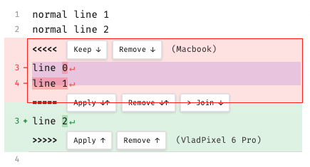
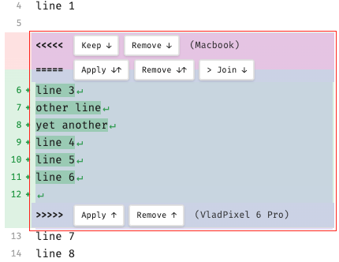
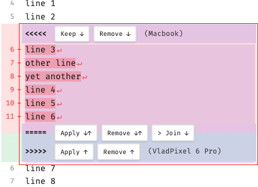
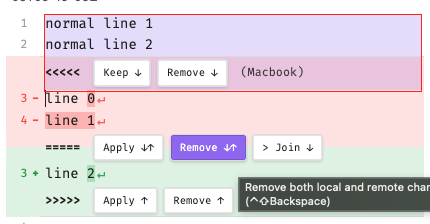
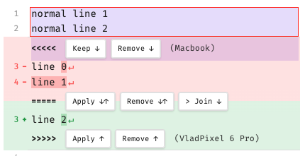
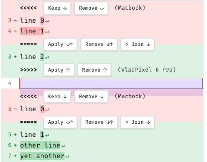

# 2. DIFF-EDITOR V2 (refactoring)

Попередня версія DIFF-EDITOR будувалася за моделю списку (масиву) "normal vs diff strings", де "normal-string" може
вміщувати точно один фізичний \0-terminated рядок редактора (рядок з одним кінцевим символом кінця рядка - \n), тоді,
як diff-string вміщував в себе "довгий diff-рядок", який складався з двох ver-blocks (ver1 block і ver2 block),
розділених символом \1. Кожний ver-block міг зберігати в собі від 0 до N звичайних рядків (дозволено багато \n символів
на один ver-block). Кінець такого diff-string - також символ \0.
([TODO.md](./DIFF-EDITOR.md#12-типи-рядків-і-термінатор)).

Однак так, як ми реалізуємо цей редактор з допомогою CM6 widgets, використовувати описане вище представлення виявилося
складно й неефективно, тому ми вимушені шукати іншої зручної форми представлення diff-документa.

CM6 документ складається з безперервного одного рядка символів, розділених усередині на рядки з допомогою символу `\n`.
Додаткові засоби CM6, такі як StateField, RangeSet, Segment[], etc. допоможуть нам оптимально розташувати в CM6-widget
наші normal, ver1 і ver2 рядки, і повніюстю реалізувати функціонал diff-editor засобами даного widget.

## 2.1. Створення diff-документа

Беремо два файли, які хочемо порівнюємо між собою (назвемо їх — base.snaphost (ours) і sibling.snapshot (their)) і
завантажуємо їх у пам'ять. Ще їх можна називати: ver1-doc і ver2-doc. Чому саме так буде зрозуміло нижче.

З допомогою бібліотеки diff2() шукаємо в завантажених файлах спільні рядки та групи рядків (diff-групи), які
відрізняються (чим і утворюють конфлікт). У результаті чого отримуємо спільні (звичайні) рядки та diff-групи.

**Diff-група** — це два паралельні набори рядків (нуль чи більше), які займають ті ж самі рядки, але в різних
документах. Саме тому й виникає конфлікт, який потрібно вирішити.

**Задача користувача** — вирішити конфлікт, вибравши: перший набір рядків, другий, обидва, чи жодний. У результаті чого
diff-група змінюється на групу звичайних рядків.

**Набори рядків, з яких складається diff-група**, називаються "ver-blocks". В одній diff-групі завжди присутні точно ДВА
такі блоки (ні більше, ні менше) i точно в такій послідовності:

1. ver1-block (від 0 до N символів з боку ours чи ver1-doc (base.snapshot))
2. ver2-block (від 0 до M символів з боку their чи ver2-doc (sibling.snapshot)).
3. ver1 і ver2 блоки НІКОЛИ НЕ ПЕРЕТИНАЮТЬСЯ, хоча завжди знаходяться впритул один до одного.

В одному diff-документі таких diff-груп може бути багато. Конфлікт вважається повністю вирішеним, коли всі
diff-групи змінилися на звичайні групи рядків.

Важлива особливість розташування diff-груп:

- diff-групи не перетинаються
- diff-групи ЗАВЖДИ розділені одним (або більше) нормальним рядком (normal string(s))

З чого виводиться наступний наслідок:

- diff-group = пара ver1-block → ver2-block, завжди в цьому порядку, суміжні (ver2-block одразу за ver1-block);
- ver1-block — або перший у doc, або безпосередньо перед ним normal string(s) (1+) (нема Range);
- ver2-block — або останній у doc, або безпосередньо після нього normal string(s) (1+) (нема Range);

Структура diff-документa виходить чистою:

```
normal-line* ver1 ver2  normal-line+  ver1 ver2  normal-line+  …  ver1 ver2  normal-line* 
             └group 0┘                └group 1┘                   └group N┘
```         

**ВАЖЛИВЕ ПРАВИЛО:** ВСІ РЯДКИ в DIFF-файлі (нормальні, diff, БЕЗ ВИКЛЮЧЕННЯ) закінчуються на `\n`. Це спрощує
редагування та вирішення конфліктів. Єдиний спосіб отримати після вирішення всіх конфліктів файл 0-ї довжини, це коли
порівнюється повністю порожній файл з одного боку з файлом з текстом з іншого. Тоді ми отримуємо єдину diff-групу, яка
містить один ver-блок порожній (delete), а другий — з даними (modify). Тобто маємо класичний конфлікт "delete-vs-modify"
або "modify-vs-delete".

### 2.2. Спосіб представлення звичайний та diff-rядків в CM6-документі

#### 2.2.1. Представлення нормальних (спільних) рядків

Отримавши набір звичайних рядків та diff-груп з `diff2()` потрібно правильно проініціалізувати буфер CM6-документу
текстовими рядками. Спільні (звичайні, normal) рядки тексту просто додаємо до CM6-документу без змін.

Тобто, отримавши набір звичайних рядків виду:

```
normal-line1\n
normal-line2\n
normal-line3\n     <== останній рядок завжди закінчується на `\n` — див."важливе правило", описане вище 

```

, переносимо їх в CM6-документ "AS-IS": "normal-line1\nnormal-line2\nnormal-line3\n"

NOTE: За замовчуванням вмикається режим перенесення довгих рядків: усі рядки в diff-документі розбиваються на логічні
рядки, якщо довжина рядка перевищує розмір екрана по ширині (необхідно для комфортного редагуванян і перегляду
конфліктів на мобільних пристроях)

#### 2.2.2. Представлення diff-рядків

Щоб краще зрозуміти, яку проблему ми вирішуємо, наводимо приклад побудови diff-документа:

Ver1-document: **file 1** (base.snapshot):

| ## | row      |
|----|----------|
| 1  | line 0\n |
| 2  | line 1\n |
| 3  | line 2\n |
| 4  | line 3\n |
| 5  | line 4\n |
| 6  | \n\n     |
| 7  | line 5\n |

Ver2-document: **file 2** (sibling.snapshot):

| # | row           |
|---|---------------|
| 1 | line 0\n      |
| 2 | \n            |
| 3 | line 1\n      |
| 4 | other line\n  |
| 5 | yet another\n |
| 6 | line 3\n      |
| 7 | line 5\n      |
| 8 | line 6\n      |
| 9 | \n            |

DIFF-документ, отриманий із цих двох вхідних файлів, виглядає приблизно так (нумерація будується так, ніби завжди
"перемагає" theirs, хоча в міру розв'язку конфліктів вона буде перебудовуватись):

```
 1   line 0
     <<<<<
     =====
 2 + \n   
     >>>>> 
 3   line 1\n
     <<<<<
 4 - line2\n
     =====
 4 + other line\n
 5 + yet another\n
     >>>>>   
 6   line 3\n 
     <<<<<
 7 - line 4\n
 8 - \n
     =====
     >>>>>
 7   line 5\n
     <<<<<
     =====
 8 + line 6\n
 9 + \n
     >>>>>   
 ```

Тут ми бачимо 4 diff-груп (кожна група розпочинається рядком "<<<<<" і закінчується рядком ">>>>>"). У кожній групі
присутні точно два ver-blocks: ver1-block (знаходиться між рядками "<<<<<" і "====="), і ver2-block (знаходиться між
рядками "=====" і ">>>>>"). ver-blocks можуть бути ПОРОЖНІМИ (ver1-block в diff-групі 1, ver2-block в diff-групі 3 і
ver1-block в diff-групі 4).

Припустимо, що ми розташовуємо всі рядки з diff-документа в одному CM6-документі, як звичайні рядки. Тоді ми отримаємо:

```
 1 line 0\n
 2 \n
 3 line 1\n
 4 line2\n
 5 other line\n
 6 yet another\n
 7 line 3\n
 8 line 4\n
 9 \n
10 line 5\n
11 line 6\n
12 \n
```

Якщо тепер створити відповідні Ranges, які будуть указувати на ver-blocks різних diff-gropus, і розмістити їх в
RangeSet, ми зможемо виділити ver-blocks у загальному CM6-doc й ефективно управляти ними. Хоча, стривай! - В такий
спосіб ми НЕ ЗМОЖЕМО відображати ПОРОЖНІ ver-blocks! Як видно нижче, ми не можемо в реальних Range зберігати вказівники
на порожні ver-blocks (а нам необхідно, щоб Range вказувало хоча б на один символ. Це нам потрібно, щоб ефективно
працював range-autosize в CM6-Ranges):

```
                              1 line 0\n
diff-group 1. ver1-block ───  ?                # empty (??? - як зберігати?)
diff-group 1. ver2-block ───  2 \n
                              3 line 1\n
diff-group 2. ver1-block ───  4 line2\n
diff-group 2. ver2-block ─┬─  5 other line\n
                          └─  6 yet another\n
                              7 line 3\n
                           ┌─ 8 line 4\n
diff-group 3. ver1-block  ─┴─ 9 \n
diff-group 3. ver2-block ───  ?                # empty (???)
                             10 line 5\n
diff-group 4. ver1-block ───  ?                # empty (???)
diff-group 4. ver2-block ─┬─ 11 line 6\n
                          └─ 12 \n
```

Щоб розв'язувати цю проблему, вирішено до кожного ver-block додавати термінальний символ `\n`. Це дозволить завжди мати
хоча б один символ в Range, навіть якщо відповідний ver-block порожній. Ось як виглядає остаточний варіант CM6-doc
з 4 diff-groups, в який зберігаються як порожні ver-blocks, так і багаторядкові:

Приклад 1:

```
                              1 line 0\n
diff-group 0. ver1-block ───  2 \n             # empty (ver1-block has only one terminal character `\n`)
diff-group 0. ver2-block ─┬─  3 \n
                          └─  4 \n             # terminal character
                              5 line 1\n
diff-group 1. ver1-block ─┬─  6 line2\n
                          └─  7 \n             # terminal character
diff-group 1. ver2-block ─┬─  8 other line\n
                          │   9 yet another\n
                          └─ 10 \n             # terminal character 
                             11 line 3\n
                          ┌─ 12 line 4\n
                          │  13 \n 
diff-group 2. ver1-block ─┴─ 14 \n             # terminal character 
diff-group 2. ver2-block ─── 15 \n             # empty  (ver2-block has only one terminal character `\n`)                           
                             16 line 5\n
diff-group 3. ver1-block ─── 17 \n             # empty  (ver1-block has only one terminal character `\n`)
diff-group 3. ver2-block ─┬─ 18 line 6\n
                          │  19 \n
                          └─ 20 \n             # terminal character 
```

Представлення diff-документа у форматі рядка-документу CM6 і RangeSet з ver-blocks:

```
linenumber:      0      0000      0     00          0           11      1      1111      11      12   
                 1      2345      6     78          9           01      2      3456      78      90   
CM6-doc string: "line 0↵↵↵↵line 1↵line2↵↵other line↵yet another↵↵line 3↵line 4↵↵↵↵line 5↵↵line 6↵↵↵
offset:          0000000000111111111122222222223333333333444444444455555555556666666666777777777788
                 0123456789012345678901234567890123456789012345678901234567890123456789012345678901
```

і діапазони (ver-blocks):

```
structureField.value = RangeSet {
   Range( 7,  8, {ver:1, group:0})   // ─┬─ конфлікт 0  (delete-vs-modify)
   Range( 8, 10, {ver:2, group:0})   // ─┘
   Range(17, 24, {ver:1, group:1})   // ─┬─ конфлікт 1  (modify-vs-modify)
   Range(24, 48, {ver:2, group:1})   // ─┘
   Range(55, 64, {ver:1, group:2})   // ─┬─ конфлікт 2  (modify-vs-delete)
   Range(64, 65, {ver:2, group:2})   // ─┘
   Range(72, 73, {ver:1, group:3})   // ─┬─ конфлікт 3  (delete-vs-modify)
   Range(73, 82, {ver:2, group:3})   // ─┘
}
```

**NOTE:** Для автоматичного "розтягування"/"звуження" діапазонів використовується Inclusive RangeSet:

1. Inclusive RangeSet → авто розтяг/звуження ПОЗИЦІЙ. Для правок усередині й на inclusive-краю діапазон сам зсуває
   to/from. АЛЕ: мапінг робиться, коли самостійно у StateField.update кличеш value = value.map(tr.changes) — один рядок,
   але не забути його викликати.
2. Захист останнього `\n` → діапазон не схлопується/не зливається. Так — блокується видалення якоря через
   transactionFilter/changeFilter → діапазон ніколи не падає нижче мінімуму й не мерджиться з сусідом.
3. Inclusive + protect-terminal-anchor = КОНТЕНТ авторесайзиться коректно. ✅ Це і є «розтяг/звуження».

**ОТЖЕ:**

Кожна diff-група (local conflict resolution group) складається з двох текстових фрагментів (груп рядків): один — це
версія тексту з лівого вхідного документа (ver1, ours, base.snapshot) і має назву ver1-block, другий — це версія тексту
з
правого вхідного документа (ver2, their, sibling.snapshot) і має назву ver2-block. В CM6-документі рядки з цих блоків
розташовуються БЕЗПОСЕРЕДНЬО один під одним, як звичайні рядки, які, однак мають дві відмінності:

1. вони мають бути зареєстровані як діапазони (Rangne))
2. у кожному з них ЗАВЖДИ має бути присутній додатковий (термінальний) `\n`.

Для чого потрібний термінальний `\n`? ver-blocks можуть бути порожніми — тож термінальний `\n` передає ідею, що в
одній з версій (ver1 чи ver2) даних узагалі не було, і дані повністю або було додано (якщо порожній ver1-block —
delete-vs-modify), або дані були вилучені (якщо порожній ver2-block — modify-vs-delete), тому для представлення таких
випадків необхідний особливий спосіб представлення.

Таким чином:

1. порожній ver-block (не плутати з порожнім рядком (який закінчується власним символом `\n`!) представляється як
   рядок "\n". Цей "\n" і називається "термінальним".
2. ver-block з даними завжди має мати щонайменеш ще один додатковий символ — "\n" перед термінальним "\n". таким чином,
   на прикладі нижче маємо ver1-block — порожній, представлений як "\n", і ver2-block — з одним порожнім рядком — "
   \n\n".
3. ver-block рядки виду ".*\n.+\n" — заборонені! Або ми маємо рядок виду "\n", або виду — ".*\n\n":

Приклад 2:

```
text before\n
<<<<<
=====
\n
>>>>>
text after\n
```

В CM-6 документі це виглядає просто як: "text before\n\n\n\ntext after\n".
А особливими рядки, як належать ver1-block і ver2-block, робить їх приналежність до діапазонів:

```
 Range(12, 13, {ver:1, group:0}); 
 Range(13, 15, {ver:2, group:0});
```

Ось приклад, як виглядає CM6-рядки diff-doc створений для вищевказаний "file 1" (ours, base.snapshot) і "file 2"
(their, sibling.snapshot):

**Joined document** (внутрішнє представлення, 4 conflicts):

| CM6 linenumber | CM6-lines     | diff-linenumber | line type                | diaps          |          
|----------------|---------------|-----------------|--------------------------|----------------|
| 1              | line 0\n      | 1               | nurmal                   |                |
| 2              | \n            | 0 (empty)       | ver1 - terminating line  | conflict1.ver1 |
| 3              | \n            | 2               | ver2 - data line         | conflict1.ver2 |
| 4              | \n            | 0               | ver2 - terminating line  | conflict1.ver2 |
| 5              | line 1\n      | 3               | normal                   |                |
| 6              | line 2\n      | 4               | ver1 - data line         | conflict2.ver1 |
| 7              | \n            | 0               | ver1 - terminating line  | conflict2.ver1 |
| 8              | other line\n  | 4               | ver2 - data line 1       | conflict2.ver2 |
| 9              | yet another\n | 5               | ver2 - data line 2       | confllic2.ver2 |
| 10             | \n            | 0               | ver2 - terminating line  | conflict2.ver2 |
| 11             | line 3\n      | 6               | normal                   |                |
| 12             | line 4\n      | 7               | ver1 - data line 1       | conflict3.ver1 |
| 13             | \n            | 8               | ver1 - data line 2       | conflict3.ver1 |
| 14             | \n            | 0               | ver1 - terminating line  | conflict3.ver1 |
| 15             | \n            | 0 (empty)       | ver2 - terminating line  | conflict3.ver2 |
| 16             | line 5\n      | 7               | normal                   |                |
| 17             | \n            | 0 (empty)       | ver1 - terminating line  | conflict4.ver1 |
| 18             | line 6\n      | 8               | ver2 - data line 1       | conflict4.ver2 | 
| 19             | \n            | 9               | ver2 - data line 2       | conflict4.ver2 |
| 20             | \n            | 0               | ver2 - terminating line) | conflict4.ver2 |

Наявність термінального '\n', який ніколи не можна вилучати з ver-block (крім випадку видалення diff-group при розв'язку
конфлікту) означає, що будь-які дії редагування (у рамках правил даних далі) з цим рядком, діапазон ЗАВЖДИ буде
залишатися
валідним:

| текст          | контент (до останнього \n) | стан                                               |
|----------------|----------------------------|----------------------------------------------------|
| "\n"           | ""                         | empty ver-block (NULL) — 1 символ, не zero-width ✓ |
| "\n\n"         | "\n"                       | один порожній рядок ✓                              |
| "111\n222\n\n" | "111\n222\n"               | два рядки ✓                                        |

Видалити все, крім останнього \n → знову "\n" (empty) — діапазон коректний (1 символ, не схлопується). ✓

Чому життєздатно:

- останній `\n` захищений (changeFilter) → діапазон ніколи не падає до zero-width (мінімум 1 символ);
- внутрішні правки — RangeSet.map сам тримає межі;
- сусідні діапазони тилюють: `[…\n][контент\n\n][\n]` — кожен зі своїм хвостовим \n.
-

#### 2.2.3 Виявлення границь різних груп:

Так, як diff2(), якщо порівняти два файли, формує три види текстових блоків — нормальний, ver1 і ver2 в певному, наперед
заданому порядку, цю інформацію можна використовувати для єврестичного доступу до тієї чи іншої групи й робити
правильні припущення про наступний очікуваний блок.

Наприклад,

1. Перший рядок документа може бути або normal або належати ver1 і НІКОЛИ не належати ver2-block.
2. Тоді, як останній рядок у документі може бути normal, або рядком блоку ver2 й НІКОЛИ не може належати ver1-block.
3. За блоком ver1 ЗАВЖДИ слідує відповідний ver2 блок без жодних перерв і НІКОЛИ після блоку ver1 не може слідувати
   normal-рядок.
4. Відповідно, ПЕРЕД ver2 блоком ЗАВЖДИ ПРИСУТНІЙ БЕЗ ЖОДНИХ ПЕРЕРВ ver1-блок і НІКОЛИ не може існувати normal-рядок.
5. В одній diff-групі НЕ МОЖУТЬ ОДНОЧАСНО БУТИ ПРИСУТНІ порожні ver1 й ver2 блоки. Бо це не є конфліктом, а отже
   має бути вирішено методом видалення такої групи.
6. В одній diff-групі НЕ МОЖУТЬ ОДНОЧАСНО БУТИ ПРИСУТНІ ver1 й ver2 блоки з однаковим змістом. Бо це також не є
   конфліктом, а отже має бути вирішено методом перетворення такої групи на групу звичайних рядків, створений
   з будь-якого ver-блоку.

Отже діють правила: [norma-line* -> ver1-line{1,N} -> ver2-line{1,M} -> normal-line*]*
тут: * - нуль або більше рядків вказаного типу; {N, М} - від N do M рядків вказаного типу; [] - група послідовних рядків

Таким чином:

1. якщо маємо діапазон ver1{from, to} це означає, що ми гарантовано можемо бути впевненими, що перед даним діапазоном:
    - або знаходиться normal-line,
    - або цей діапазон на самому початку файлу;
      і ми точно впевнені, що наступний за цим діапазоном слідує відповідний діапазон ver2, який стосується цього ж
      конфлікту.
2. відповідно, маючи діапазон ver2{from, to} ми впевнено можемо очікувати, що перед цим діапазоном ТОЧНО присутній
   відповідний діапазон ver1, який належить цьому ж конфлікту, а за цим діапазоном точно присутній нормальний рядок, або
   ж — це останній діапазон у цьому файлі.

Ці знання повинні нам полегшувати прийняття рішення з управління навігацією, виділенням тексту та розв'язком конфліктів.

#### 2.2.4 Правила поводження в ver-block (окремий діапазон рядків CM6)

1. діапазон має ГАРАНТОВАНО мати щонайменше один рядок, тобто `[begin, end)` має вказувати на термінальний
   символ-маркер "\n" — порожній рядок й усі символи, які будуть вставлятися ПЕРЕД цим символом, будуть сприйматися
   безпосередньо, як текстові рядки, які належать даному ver-block. Символ-маркер '\n' не можна видаляти взагалі, це
   зроблено для того, щоб діапазон не міг випадково зникнути. Таким чином діапазон буде існуватти увесь час, поки
   конфлікт не буде розв'язано повністю.

   Даю визначення "порожнього рядка":
   > Порожній рядок у ver-block — це рядок, який символізує, що даний варіант заміни являє собою видалення
   ВСІХ СИМВОЛІВ (delete), а не вставку порожнього рядка (тобто рядка виду "\n"):

   Приклад 3:
   ```
   <<<<<
   =====
   ver2 text\n
   >>>>>
   ```
   насправді представлено так:

   ```
   <<<<<
   \n                <== це рядок ФІЗИЧНО присутній в редакторі, але прихований від користувача (height: 0px) коли 
   =====                 на цьому рядку немає фокусу (курсору). Це — особливе правило для порожніх ver-блоків
   ver2 text\n
   \n                <== це рядок ФІЗИЧНО присутній в редакторі, але прихований від користувача (height: 0px) ЗАВЖДИ 
   >>>>>
   ```

   Отже, дпя представлення порожнього рядка в ver1-block (вище показано між рядками "<<<<<" і "=====")
   використовується рядок з термінальним "\n". Щоб цього рядка не було видно, методами CM6-widget, висота цього рядка
   (І ТІЛЬКИ ЦЬОГО РЯДКА, І ТІЛЬКИ КОЛИ НА НЬОМУ НЕМА ФОКУСА (КУРСОРУ)) встановлюється в 0.

   У цьому прикладі:

    - ver1-block зберігається як діапазон, який вказує на фрагмент "\n" в тексті, і, відповідно,
    - ver2-block в цьому прикладі зберігається як діапазон, який вказує на фрагмент "ver2 text\n\n".
    -
   Присутність послідовності "\n\n" (кінець рядка + термінальний `\n`) — обов'язкова! Саме вона дає нам зрозуміти, що
   цей ver-block не порожній і в ньому присутні дані. Наприклад, нехай ver2-block вмішує порожній рядок ("\n"), а
   ver1-block і далі зберігає в собі порожній блок (тобто повну відсутністть даних), який натякає на те, що дані при
   виборі цього варіанту буде видалено взагалі:
   ```
   <<<<<
   \n       # термінальний "\n" в кінці блоку (невидимий, height: 0px)
   =====
   \n
   \n       # термінальний "\n" в кінці блоку (невидимий, height: 0px)
   >>>>>
   ```
   таким чином ver1-block представлений рядком "\n" (видалення даних), а ver2-block — рядком "\n\n" (вставка
   порожнього рядка), І в першому, і в другому варіанті в нас неявно (для користувача) представлено прихований
   (висота рядка 0) останній рядок (термінальний "\n" в кінці блоку).

2. Починаючи редагувати порожній рядок ("|\n", де "|" — це схематичне зображення курсора, де вставляється текст),
   користувач може додати будь-який символ, але одразу ж після цього (якщо введені користувачем дані в кінці не мають
   символу "\n", він буде АВТОМАТИЧНО доданий. Вірніше, навіть не так: "після вставки даних користувачем іде перевірка,
   чи
   в кінці ver-block-рядка присутня послідовність "\n\n", і якщо її нема — вона автоматично відновлюється.
   Таким чином, якщо редагувати текст між цими двома "\n", на який вказує діапазон, діапазон буде завжди розширюватись
   і звужуватись, ніколи не зникаючи повністю:
   ```pseudo-code
   якщо (range.to - range.from > 1) та doc[range.to - 2] != '\n' 
   тоді вставити '\n' в позицію range.to - 1
   ``` 

3. методами редагування потрібно завжди блокувати видалення останнього (термінального) \n, якщо ти знаходишся в режимі
   редагування цього div-block-діапазону (тобто курсор знаходиться в позиції `[range.from, range.to-1]`.
   Тобто цей діапазон (перед термінальним `\n`) сприймається як окремий "документ" ("окремий" від основного
   diff-документа, в який він включений). Тобто цей "документ" може бути порожнім: "\n" (що еквівалентно текстовому
   документу з розміром 0), або мати один порожній рядок: "\n\n", або будь-яку кількість рядків: ".*\n\n". Користувач
   може редагувати цей "документ" довільно, єдине що йому заборонено робити — так це видаляти термінальний `\n` і
   вставляти дані (які не закінчуються на '\n') після `\n` перед термінальним: тобто `.*\n\n` — дозволена дія,
   а `\n.+\n` — заборонена. Для виправлення останньої забороненої дії й використовується перевірка з п.2 вище.

4. видалення цілого рядка (якщо це останній рядок виду `.*\n\n`) має в результаті трансформуватись в рядок `\n`
   (термінальний символ), тобто діапазон ver-блоку не "схлопується" до нуля, а отже і не знишується. Фактично, ми
   зарраз показуємо, що цей ver-block символізує про повне видалення з нього даних.

5. selection, розпочатий в ver-block-діапазоні (`[range.from, range.to-1]`) може містити ТІЛЬКИ символи від початку
   діапазону й аж до термінального `\n` (НЕ ВКЛЮЧНО!):
   a. ОСТАННІЙ (ТЕРМІНАЛЬНИЙ) `\n` НІКОЛИ НЕ ПОТРАПЛЯЄ В selection!
   b. Selection, який розпочався в цьому діапазоні НІКОЛИ НЕ ВИХОДИТЬ ЗА ЙОГО МЕЖІ!!! Тобто, якщо маємо
   Range(N, M, {ver:1, group:0}), й N <= selection-begin < М, тоді й N <= selection-end < M
   ([§1.7 Правила виділення (selection)](./DIFF-EDITOR.md#17-правила-виділення-selection))
   c. Ctrl+A або віділення від початку і до кінця може видалити ВСІ символи в діапазоні (крім термінального `\n`),
   d. однак, якщо після видалення selection або replace його іншими даними виявиться, що `Range.to - Range.from > 1` і
   передостанній символ в діапазоні не є символом `\n`, то цей символ буде додано АВТОМАТИЧНО (п.2 вище).
   Приклад: ver-block: "word1\nword2\n\n", нехай виділяємо: `"w[ord1\nword2\n]\n"` (сивмоли '[`,`]' символізують
   початок і кінець виділення). Отримуємо в результаті "w\n". Запускаємо правило п.2:
    - довжина діапазону > 0? — ТАК!
    - Передостанній символ — це символ '\n'? — НІ!
    - Тоді додаємо цей символ АВТОМАТИЧНО: "w\n\n".

   Таким чином допустимими є тільки такі рядки, які правильно представляють ver-blocks: "\n" та ".*\n\n". Блоки виду
   ".*\n.+\n" — НЕДОПУСТИМІ!

6. `[Backspace]` натиснений, коли `позиція_курсора == Range.from` ігнорується так, ніби це перший символ в документі
   (позиція 0,0). Таким чином ні цей, ні попередній діапазон НІКОЛИ НЕ РУЙНУЄТЬСЯ.

7. `[Delete]`, коли курсор знаходиться безпосередньо ПЕРЕД останнім `\n` цього діапазону (e.g. |\n, де '|' — це позиція
   курсора): `позиція_курсора == Range.to-1` — ігнорується так, ніби це останній символ в документі. Таким чином
   діапазон також НІКОЛИ НЕ РУЙНУЄТЬСЯ.

8. Видалення УСІХ символів з діапазону. Як ми показували вище, діапазон НІКОЛИ не може згорнутися до меншого рядка за
   такий: "\n" (з термінальним `\n`). Тому, коли ми виділили увесь діапазон (п.5) або видалили останній символ "\n"
   перед термінальним "\n" (п.6,7), рядок природним чином переходить в режим "порожнього рядка" (п.1). Тобто:
   а. якщо виділити увесь діапазон (п.5) і натиснути `[Delete]` - діапаозн повинен стати "\n", бо термінальний символ
   `\n` в діапазон не входить.
   b. якщо маємо рядок виду "|\n" ('|' тут — це позиція курсора) і тиснемо `[Backspace]` (p.6) — діапазон
   залишається "\n".
   с. якщо маємо рядок виду "|\n" ('|' тут — це позиція курсора) і тиснено `[Delete]` (p.7) — діапазон
   залишається "\n".

9. Клавіші управління курсором (крім клавіш виділення тексту (text selection)) дозволяють покинути діапазон
   безперешкодно. Однак! Через те що в нас В НЕПОРОЖНЬОМУ ver-block (виду `*.\n\n`) ЗАВЖДИ присутній прихований
   (height: 0px) порожній рядок (термінальний "\n"), якщо при редагуванні ver-блоку користувач натисне клавіші,
   які можуть змістити курсор вниз по руху тексту (`[Down]`, `[PgDn]`, `[Right]` (в останній позиції рядка)), тоді
   діють наступні правила:

   a. Якщо, в разі такої дії, курсор не покидає даний ver-block (`start_position in [cur_range.from, cur_range.to]`) —
   жодних додаткових дій робити не потрібно
   b. Якщо, в разі такої дії, курсор опинився між термінальним `\n` і символом кінця рядка при непорожньому блоці:
   `cur_range.to - cur_range.from > 1 and cursor.position == cur_range.to-1`, тоді додаємо `[Down]` при натисненні
   `[Down]` чи `[PgDn]`, або `[Right]` при натисненні `[Right]`.
   c. Для всіх іншх `[PgDn]` (з нормальних рядків чи ver-blocks): рахуємо скільки range.to ми в результаті дії
   перескочили й додаємо стільки ж `[Down]`, після чого знову перевіряємо правило 9.b.
   Наприклад, для прикладу 1:
      ``` 
                                                                                                            1
      linenumber:      0      0000      0     00          0           11      1      1111      11      12   2 
                       1      2345      6     78          9           01      2      3456      78      90...3...   
      CM6-doc string: "line 0↵↵↵↵line 1↵line2↵↵other line↵yet another↵↵line 3↵line 4↵↵↵↵line 5↵↵line 6↵↵↵... ...
      offset:          0000000000111111111122222222223333333333444444444455555555556666666666777777777788... ...    
                       0123456789012345678901234567890123456789012345678901234567890123456789012345678901... ...
      ```
   і діапазони (ver-blocks):
      ```
      structureField.value = RangeSet {
      Range( 7,  8, {ver:1, group:0})   // ─┬─ конфлікт 0  (delete-vs-modify)
      Range( 8, 10, {ver:2, group:0})   // ─┘
      Range(17, 24, {ver:1, group:1})   // ─┬─ конфлікт 1  (modify-vs-modify)
      Range(24, 48, {ver:2, group:1})   // ─┘
      Range(55, 64, {ver:1, group:2})   // ─┬─ конфлікт 2  (modify-vs-delete)
      Range(64, 65, {ver:2, group:2})   // ─┘
      Range(72, 73, {ver:1, group:3})   // ─┬─ конфлікт 3  (delete-vs-modify)
      Range(73, 82, {ver:2, group:3})   // ─┘
      }
      ```
   Якщо курсор знаходиться в рядку 5 на позиції 12 і ми натиснули `[PgDn]` і якщо припустити, що після останнього
   Range в нас документ ще продовжується, нова позиція курсора була б:
      ```
      1. зміщуємо курсор в нову позицію після `[PgDn]`
      2. дізнаємось offsset нової позиції курсору (нехай це 123, що відповідає рядку 30)
      3. шукаємо перший Range, де to > 12 - це Range(17, 24, {ver:1, group:1}) 
      4. рахуємо скільки Range потрібно перескочити, щоб to >123. Отримали 6 ranges.
      5. додаємо 6 `[Down]` до нашої позиції курсору і отримуємо 36-й рядок
      ```

   Одразу ж потрібно продумати дзеркальні дії, при русі знизу вгору (`[Up]`, `[PgUp]`, `[Left]`):

   e. Якщо, в разі такої дії, курсор не покидає даний ver-block — жодних додаткових дій робити не потрібно.
   f. Якщо в разі такої дії, курсор опинився між термінальними `\n` ПОПЕРЕДНЬОГО НЕ ПОРОЖНЬОГО(!) ver-block:
   `prev_ver_block.range.to - prev_ver_block.range.from > 1 and cursor.position == prev_ver_block.range.to-1`,
   тоді додаємо `[Up]` при натисненні `[Up]` чи `[PgUp]` або `[Left]` при `[Left]`.
   g. Для всіх інших `[PgUp]` підраховуємо скільки range.to ми в результаті дії перескочили ВГОРУ (дзеркально п.9c)
   і додаємо стільки ж `[Up]`, після чого знову перевіряємо правило 9.f.

   h. МИШКА / ТАП (вхід у блок без клавіатури). Клік (чи тап на тачскріні) по гліфу маркера ставить курсор У
   відповідний ver-block, ДЗЕРКАЛЬНО до клавіатурного входу:
    - `<<<<<` (open) → ver1, **перший** рядок, позиція 0 (як `[Down]` з нормального рядка ЗВЕРХУ);
    - `>>>>>` (close) → ver2, **останній** контент-рядок, позиція 0 (як `[Up]` з нормального рядка ЗНИЗУ);
    - для ПОРОЖНЬОГО блоку — у його єдиний slot (`range.from`), що через фокус розкриває його (§2.2.8). Це
      ЄДИНИЙ спосіб досягти порожнього (collapsed, `height:0`) ver-block мишкою/тапом — без цього він некліка­бельний.
    - гліф `=====` (mid) ціллю НЕ є.
      Реалізація: чиста `verBlockCaretTarget(doc, ranges, group, ver)` + `mousedown`-слухач на гліфі маркера в
      `diff-pane-v2.ts` (preventDefault/stopPropagation, як у кнопок резолву; тап емулює mousedown); тести
      `marker-click-caret.test.ts`.

10. Багатокурсор — повністю вимкнути (неможливо коректно відстежити й не суттєво для вирішення конфліктів).
    Це прибирає цілий клас edge-cases — лишається одне виділення.

#### 2.2.5 Захист diff-blocks ззовні

1. Натиснення `[Delete]` на нормальному рядку, який знаходиться безпосередньо ПЕРЕД diff-group (ver1-block), НЕ ВИДАЛЯЄ
   символ `\n` цього рядка якщо перед ним немає іншого `\n`. Тобто:
   ```typescript
   if (
      cursor.position == next_ver_block.range.from - 1 && 
      doc[cursor.position] == `\n` &&
      cursor.position > 0 && 
      doc[cursor.position - 1] != `\n`
   ) {
     return;
   }
   ```
   Приклад 4:
   ```
   normal line|\n     # '|' - позиція курсору. Натиснення `[Delete]` в цій позиції НЕ ВИДАЛЯЄ символ `\n` цього рядка.
   <<<<<
   ver1-block\n
   \n
   =====
   ver2-block\n
   \n
   >>>>>
   other normal line\n 
   ```
2. Натиснення `[Backspace]` на нормальному рядку, який знаходиться безпосередньо ПІСЛЕ diff-group (ver2-block), НЕ
   ВИДАЛЯЄ термінальний символ `\n` ver2-block, який йому передує:
   ```typescript
   if (cursor.position == prev_ver_block.range.to) {
     return;
   }
   ```
   Приклад 5:
   ```
   normal line\n
   <<<<<
   ver1-block\n
   \n
   =====
   ver2-block\n
   \n
   >>>>>
   |other normal line\n        # '|' - позиція курсору. Натиснення `[Backspace]` в цій позиції НЕ ВИДАЛЯЄ термінальний
                               #       символ `\n` ver2-block .
   ```
3. ОКРЕМИЙ ВИПАДОК: Злиття двох diff-groups разом. Коли між двома diff-groups залишається один порожній normal line
   (`\n`), тоді натиснення `[Delete]` чи `[Backspace]` (будь-якої з цих клавіш) ініціює злиття двох diff-groups разом.
   Ще одним випадком злиття є видалення єдиного рядка між двома дiff-groups командою delete-line (Shift+Cmd+K, чи
   (в нашому випадку) – `CTRL+Y`). Див. деталі в розділі 2.2.12.

#### 2.2.6 Виділення окремих ver-blocks і цілих diff-groups

Вище ми зазначили, що selection в межах одного ver-block ЗАВЖДИ залишається в межах цього блоку. Однак, для
більш-природнього й інтуітивного виділення згідно з існуючими правилами UX текстових редакторів пропоную дотримуватись
таких правил:

1. Ctrl+A виділяє УВЕСЬ ДОКУМЕНТ, де б не був курсор: чи в ver-block, чи на normal-line;

2. Якщо виділення почалось на normal-line, і на шляху виділення є diff-group (ver1-block + ver2-block) — як тільки
   виділення захоплює хоча б один символ з diff-group — УСЯ diff-group вважається виділеною:
   Приклад. Нехай у нас є така diff-group (з прикладу 1):
   ```
      Range(17, 24, {ver:1, group:1})   // ─┬─ конфлікт 1  (modify-vs-modify)
      Range(24, 48, {ver:2, group:1})   // ─┘
   ```
   тоді, якщо selection було почато ДО offset 17 чи з offset 47+ і в процесі виділення другий кінець selection
   опинився в діапазоні `[17,48)`, тоді УСЯ diff-group 1 повинна бути виділена, тобто увесь діапазон `[17,47]`
   ПОТРАПЛЯЄ У ВИДІЛЕННЯ. Таким чином, у виділення, розпочате на normal-line, diff-group потрапляє як окремий символ:
   або все, або нічого.

3. Якщо виділення почалось всередині одного ver-block, але перекинулось на суміжний в межах даної diff-group, наприклад,
   на прикладі з п.2 - selection розпочався в позиції 20 (ver1-block) і перейшов на позицію 24 (ver2-block), тоді
   УСЯ diff-group вважається виділеною! — тобто виділення охопить символи з 17 по 47 включно.

4. Якщо виділення почалось всередині одного з ver-blocks, але продовження виділення вийшло за межі diff-group, тоді
   УСЯ diff-group вважається виділеною!

5. При віділенні з допомогою курсора - `[Shift] + <клавіші управління курсорорм>` правила з 2.2.4 (9) залишаються
   в силі.

6. При виділенні з допомогою мишки, правила діють схожим чином: в межах одного ver-block — виділяються тільки символи
   з даного ver-block як plain text, при виході selection за межі ver-blocks — diff-group виділяється як єдине ціле.

7. UI/UX виділення diff-groups:

   a. якщо виділено всі рядки ver1-block, то візуально виділення має покривати всі рядки в цьому diff-group, які мають
   "червоний" фон, тобто виділення повинно починатись з рядка "<<<<<" і захоплювати верхню половину рядка з "====="
   (фон якої також зафарбовано червоним кольором), це дає зрозуміти користувачу, що виділено цілком ver1-diff без
   залишку. Це показує користувачу, що УВЕСЬ ver1-block виділений без залишку.
   Див. як приклад:
   

   b. якщо виділено всі рядки ver2-block, то візуально виділення має покривати всі рядки в цьому diff-group, які мають
   зелений фон, тобто виділення повинно починатись з рядка нижньої половини рядка з "====="
   (фон якої також зафарбовано зеленим кольором) і містити рядок з ">>>>>", це дає зрозуміти користувачу, що
   виділено цілком УВЕСЬ ver2-diff без залишку.

   c. Маркери diff-group ("<<<<<", "=====", ">>>>>") мають особливе значення для виділення. 
   Selection (click-і-утримання правої кнопки мишки, коли курсор рухається вниз чи вгору, виділяючи текст), 
   ЯКІ ЗДІЙСНЮЮТЬСЯ З ДОПОМОГОЮ ВКАЗІВНИКА ТИПУ МИШКА, і які починаються в цих цих маркерах, і selection, які 
   закінчуються на цих маркерах (тобто, ліва кнопка мишки відпускається, коли вказівник мишки знаходиться на цих
   маркерах) мають дуже чітке значення, яке допомагає чітко і точно виділяти потрібні області тексту навіть коли 
   саме позиціювання мишкою не дуже точне. Ось таблиця реакцій на різні selection, які починаються чи закінчуються
   на маркерах diff-group ("<<<<<", "=====", ">>>>>"):
      i. (a) selection початий десь НАД diff-group і який закінчився на маркері "<<<<<" даної групи означає: "виділити
         і додати до selection фінальний `\n`, останньої normal line, тієї що знаходиться безпосередньо
         ПЕРЕД diff-group (клавіатурний еквівалент — 2.2.6 п.7.e.i.(a), тобто фактично ми на останній normal line 
         робимо еквівалент команди `[Shift]+[End]`). Те, що selection закінчився на маркері "<<<<<" (тобто на цьому 
         маркері користувач відпустив ліву кнопку миші) вказує на те, що НЕ ПОТРІБНО ніяк виділяти саму diff-group 
         (говоримо про саму diff-group, а не ver1-block, тому, що до normal lines ми не маємо додати diff-group або 
         в повному складі, або взагалі не додавати (правило 2.2.6 п.2);
         (b) Якщо ж при цьому виділення продовжиться нижче, тобто мишка переміститься НИЖЧЕ зони "<<<<<" (мишка 
         курсора при затисненій правій кнопці мишки опиниться НИЖЧЕ маркер "<<<<<" цієї diff-group), тоді вже 
         УСЯ DIFF-GROUP ВИДІЛЯЄТЬСЯ І ДОДАЄТЬСЯ ДО Selection (клавіатурний еквівалент - 2.2.6 p.7.e.i.(b));

      ii. (a) selection початий десь НИЖЧЕ по тексту за нашу diff-group і який закінчився на маркері ">>>>>" даної групи
      означає: "виділити і додати до selection початок першої normal line, той що знаходиться безпосередньо ПІД 
      diff-group, в зоні ">>>>>" якого selection закінчився, не виділяючи ніяк саму diff-group; Фактично на 
      цій першій після diff-group normal line selection_end встановлюємо на 0 цього рядка. Саме так зараз працює 
      клавіатурний еквівалент: Якщо виділення відбувається з допомогою `[Shift] + [Up]`, а позиція курсору 
      (selection_end при select знизу вгору) >0, тоді коли selection_end опиняється в normal line, який знаходиться
      БЕЗПОСЕРЕДНЬО ПІД diff_group, і знову натиснути `[Shift] + [Up]`, тоді зараз курсор скаче в позицію 0 цього рядка
      і тільки вже наступним кроком почне відмічати diff-group. Так само має бути й тут: якщо ми почали виділили текст 
      НИЖЧЕ diff-group, а закінчили (відпустили ліву кнопку мишки) на маркері ">>>>>", тоді selection повинен 
      включати в себе тільки зону нижче diff-group починаючи з позиції 0 першого після diff-group normal line.
      (b) Якщо при цьому виділення продовжиться далі вгору, тобто мишка переміститься ВИЩЕ маркера ">>>>>" (мишка 
      курсора при затисненій лівій кнопці мишки опиниться ВИЩЕ маркера ">>>>>", тоді УСЯ DIFF-GROUP ВИДІЛЯЄТЬСЯ І 
      ДОДАЄТЬСЯ ДО selection;

      iii. (a) selection початий на маркері "<<<<<" і закінчений будь-де в межах ver1-block (тобто від "<<<<<" до "====="
      включно) чітко сигналізує що ВИДІЛЕННЯ ПОЧАЛОСЬ В ПОЗИЦІЇ 0 ПЕРШОГО РЯДКА ver1-block і ЗАКІНЧИЛОСЬ там, де була
      відпущена ліва кнопка миші, тобто виділяється plain text в межах ver1-block! Отже, якщо користувач почав виділення
      (клікнув мишкою і потягнув її вниз з затисненою лівою кнопкою миши) на маркері "<<<<<", тоді text Selection 
      фактично стартує з позиції 0 першого рядка ver1-block!
      (b) УВЕСЬ ver1-block підсвічується як виділений, ЗА УМОВИ, ЩО користувач закінчив selection десь на 
          маркері "=====".
      (c) Якщо ж користувач продовжить виділення вниз і ПЕРЕТНЕ середину (50% висоти) маркеру "=====" в центрі 
      diff-group, тоді вже УСЯ DIFF-GROUP вважається повністю виділеною, за умови, що selection буде закінчене 
      будь-де в межах ver2-block (між маркерами "=====" і ">>>>>" ВКЛЮЧНО).
      (d) Якщо selection продовжиться вниз далі, тоді selection включить в себе УСЮ DIFF-GROUP і всі наступні за 
      нею блоки тексту, поки selection не буде зупинено.

      iv. (a) selection початий на кінцевому маркері diff-group ">>>>>", проодовжувалось вгору і закінчений будь-де в межах 
      ver2-block (тобто між "=====" до (">>>>>" включно) чітко сигналізує, що виділено ЧАСТИНУ ver2-block, яка точно
      закінчується останній \n цього блоку (крім термінального символа ver-block (`\n`), який в selection не потрапляє
      (крім вінятку, коли це ver-block останньої diff-group в документі, після якої вже нема normal lines. Отже, 
      якщо користувач почав виділення (клікнув мишкою і потягнув її вгору з затисненою лівою кнопкою миші) на маркері \
      ">>>>>", тоді виділення формально починається так ніби це клавіатурне виділення вгору при selection_start в 
      позиції 0 normal line ПІД diff-group
      (b) ver2-block підсвічується як виділений, ЗА УМОВИ, ЩО користувач закінчив selection на маркері "=====".
      (c) Якщо ж користувач продовжить виділення вгору і ПЕРЕТНЕ середину (50% висоти) маркеру "=====" в центрі 
      diff-group, тоді вже УСЯ DIFF-GROUP вважається повністю виділеною, за умови, що selection буде закінчене 
      будь-де в межах ver1-block (між зонами "<<<<<" та "=====" включно).
      (d) Якщо selection продовжиться вгору далі, тоді selection включить в себе УСЮ DIFF-GROUP і всі блоки тексту 
      НАД нею, поки selection не буде зупинено.

      v. selection початий в межах текстових рядків ver1-block (тобто між "<<<<<" і "=====" НЕ включно), виділяють
      безпосередньо частину тексту ver1-block. ОДНАК, ЯК ТІЛЬКИ мишка при цьому selection потрапляє в зони "<<<<<"
      чи вищу частину (верхні 50% висоти) "=====", одразуж УВЕСЬ ver1-block вважається виділений! Подальший рух 
      виділення вгору/вниз відбувається так само як в п7.iii)

      vi. selection початий в межах текстових рядків ver2-block (тобто між "=====" і ">>>>>" НЕ включно), виділяють
      безпосередньо частину тексту ver2-block. ОДНАК, ЯК ТІЛЬКИ мишка при цьому selection потрапляє в маркери "=====" 
      (нижню частину (ніжні 50% висоти)) чи ">>>>>", одразуж УВЕСЬ ver2-block вважається виділений! Подальший рух 
      виділення вгору/вниз відбувається так само як в п7.iv)

   e. при виділенні не мишкою, а з допомогою клавіатури, правила можуть дещо відрізнятись від тих, які ми бачимо при
   виділенні мишкою.

      і. (a) selection розпочатий в normal-lines НАД diff-group при переході кордону diff-group
         ([Shift]+[Down]/[Rigt]/[PgDn]), при якому курсор опиняється в позиції 0 першого (чи єдиного, чи порожнього
         (empty ver1-block)) рядка ver1-block, вважається selection ТІЛЬКИ NORMAL LINE(S) НАД даною diff-group!
         В такому випадку візуальне selection повинно відмічати ТІЛЬКИ NORMAL LINES, жодним чином не зачіпаючи
         diff-group (2.2.6 п.7g). І тільки, якщо:
         (b) буде виділено ХОЧА Б ОДИН реальний СИМВОЛ diff-group — ВСЯ diff-group вважається виділеною (2.2.6 п.2). 
         Для empty ver1-block це означає, що якщо selection почався вище diff-group і закінчився на позиції 0 empty 
         ver1-block, то виділення стосується тільки normal lines ВИЩЕ diff-group, і тільки розширення selectioin 
         далі ([Shift]+[Down]/[Rigt]/[PgDn]) при якому курсом вже переміститься на vер2-блок (бо ver1-block порожній), 
         тільки за такої дії УСЯ diff-group об'являється виділеною: 
         

      ii. (a) selection розпочатий в позиції 0 першого рядка ver1-block при переході межі між ver1-block і ver2-block
          ([Shift]+[Down]/[Rigt]/[PgDn]), при якому курсор опиняється в позиції 0 першого (чи єдиного, чи порожнього
          (empty ver2-block)) рядка ver2-block, вважається selection ТІЛЬКИ І ВСЬОГО ver1-block lines! В такому випадку
          візуальне selection повинно відмічати УВЕСЬ ver1-block і ТІЛЬКИ ЦЕЙ БЛОК, жодним чином не зачіпаючи
          ver2-block!
          (b) І тільки, якщо буде виділено ХОЧА Б ОДИН реальний СИМВОЛ ver2-block — ВСЯ diff-group вважається
          виділеною (2.2.6 п.3).
          (c) Для empty ver2-block це означає, що якщо selection почався в НЕ ПОРОЖНЬОМУ ver1-block і закінчився на
          позиції 0 empty ver2-block, то виділення стосується тільки ver1-block, і тільки розширення selectioin далі
          ([Shift]+[Down]/[Rigt]) при якому курсом вже переміститься за межі diff-group (бо ver2-block порожній!),
          тільки за такої дії УСЯ diff-group об'являється виділеною:
          
          (d) ВАЖЛИВЕ ВИКЛЮЧЕННЯ!: Якщо ver1-block — порожній (empty ver-block), і на ньому почати виділення
          (наприклад, натиснути `[Shift]+[Down]`, щоб курсор перемістився в ver2-block, тоді фактично ми виділяємо є
          "НІЧОГО"! Атже ver1-block — EMPTY!!! Отже, виділення вважається розпочатим НЕ В ver1-block
          (БО ВІН - ПОРОЖНІЙ!), а з ПЕРШОЇ ПОЗИЦІЇ ver2-block, так ніби користувач перейшов з порожнього ver1-block на
          початок ver2-block не з допомогою `[Shift]+[Down]`, а просто `[Down]`, а вже потім натиснув `[Shift]`...
          (e) Якщо ж selection розпочатий в ненульовій позиції першого рядка ver1-block чи в будь-якому іншому рядку
          ver1-block (назвемо це - "всередині" ver1-block), тоді при переході в позицію 0 першого рядка порожнього
          чи ні ver2-block, до selection потрапляють ТІЛЬКИ безпосередньо виділені в ver1-block символи, без
          термінального `\n`, і візуальне selection відмічає тільки рядки тексту ver1-block, а не увесь ver1-block
          (з зонами "<<<<<" і "=====")!

      iii. (a) selection розпочатий в 0-й позиції першого рядка ver2-block при переході за межі diff-group
           ([Shift]+[Down]/[Rigt]/[PgDn]), при якому курсор опиняється в позиції 0 першого за цим diff-group normal line,
           вважається selection УСЬОГО ver2-block І ТІЛЬКИ цього ver-block! Тобто, в кліпбоард потрапляють усі рядки
           ver2-Region без термінального символу `\n`. В такому випадку візуальне selection повинно відмічати ТІЛЬКИ
           УВЕСЬ ver2-block, жодним чином не зачіпаючи НІ НАСТУПНИЙ normal line, не виділяючи усю diff-group!
           (b) І тільки, якщо буде виділено ХОЧА Б ЩЕ ОДИН реальний СИМВОЛ за межами ver2-block — ВСЯ diff-group
           вважається виділеною (2.2.6 п.3) і додається до selection.
           (c) Для empty ver2-block це означає, що якщо selection, який почався в позиції 0 цього ver-block, НЕ ВКЛЮЧАЄ
           в себе цей ver2-block ВЗАГАЛІ (БО ВІН ЖЕ — "ПОРОЖНІЙ"!), а selection, фактично, починається з позиції 0
           в першому normal line, який іде одразу ж за diff-block.
           (d) Якщо ж selection розпочатий в ненульовій позиції першого рядка ver2-block чи в будь-якому іншому рядку
           ver2-block (назвемо це - "всередині" ver2-block), тоді при переході в позицію 0, першого за цим ver2-block
           normal line, до selection потрапляють ТІЛЬКИ безпосередньо виділені в ver1-block символи, без
           термінального `\n`, і візуальне selection відмічає тільки рядки тексту ver2-block, а не увесь ver2-block
           (з зонами "<<<<<" і "=====")!

   f. click мишкою по рядку "=====" з затиснутою кнопкою `[Shift]` (коли ще не ясно що буде виділено) очікує рух 
      мишки вниз чи вгору по тексту:
      (a) Якщо мишка рухнулась вверх, тоді виділення починається в ver1-block (plain text) і
      (b) якщо selection закінчено на "<<<<<", тоді виділяється увесь ver1-block (помічається (як вказано в п.7c цього 
          розділу) як виділений).
      (c) Якщо ж мишка рухнулась вниз, тоді виділення позинається в ver2-block (plain text) і
      (d) якщо selection закінчено на ">>>>>", тоді виділяється УВЕСЬ ver2-bllock (помічається (як вказано в п7c цього 
          розділу) як виділений).

   g. Якщо користувач виділяє normal lines повністю (з фінальними `\n`) (наприклад, п.7c.i-7c.ii), то виділення повинні
   охоплювати тільки виділені рядки, і не розповсюджуватись на diff-group, після цих normal lines (зверни увагу на
   redbox, який показує, що виділення заїхало на територію diff-group (ver1-block):

   

   коли очікується така поведінка (дивись red box):

   

   h. Якщо користувач виділяє порожній рядок між двома diff-groups (наприклад, почавши виділення мишкою в цьому рядку,
   а закінчивши на зоні "<<<<<" нижчої diff-group, п.7c.i), то виділитись має тільки цей normal line, і виділення
   не повинно заходити на diff-group (зверни увагу на red box, який показує як selection хибно розповсюджується на
   diff-group нижче selected empty normal line):

   

   тоді, як очікується така поведінка (дивись red box):

   

---

##### 2.2.6.R — РЕНДЕР виділення: реалізація та інваріанти (impl-нотатка, 2026-06-26)

> Це нотатка РЕАЛІЗАЦІЇ (як саме малюється виділення), а не  правил поведінки вище. Зафіксована, щоб майбутні зміни не
> відтворили вже виправлені артефакти. Усі пункти device-verified; render-баги перевіряються в Chromium-harness (
`harness/diff-pane-harness.*`), бо happy-dom не бачить геометрію CM6 — див. memory `project-diff2-render-oracle`.

1. **Контент-рядки виділяються NATIVE CM6** (`drawSelection`/`.cm-selectionBackground`) — свій band ми НЕ малюємо, лише
   перекриваємо КОЛІР на `--text-selection` (`styles.css`). Тому правила п.7 нічого не «домальовують» на рядках — лише
   легалізують діапазон (`diff-selection.ts`), а CM6 його малює.

2. **`line-height` мусить тримати selection-rect ≈ висоту рядка-боксу.** native `drawSelection` малює rect висотою
   ТЕКСТУ (~18px), а НЕ повного рядка-боксу. При `line-height: var(--line-height-normal)` (~1.5 → 24px) виникав leading
   3px зверху/знизу, який CM6 ховає злиттям сусідніх рядків, АЛЕ оголює на block-widget маркерах (`<<<<<`/`=====`/
   `>>>>>`) — проміжок зверху + смужка, що висовується з-під маркера на наступний рядок (bug-47). *
   *Фікс: `line-height: 1.2`** (вимір: rect≈бокс, gap 1px). НЕ повертати `--line-height-normal` і не покладатись на
   `font-size-adjust` (він додає лише ~2px). Корінь і метод (harness geometry dump) — у memory.

3. **Виділення САМИХ маркерів — наш `::before`-overlay** (`.diff2-marker-sel-{full,top,bottom}::before`,
   `--text-selection`), бо маркери OPAQUE (bug-34/33: щоб native-band не протікав крізь них), і native-виділення за
   маркером не видно. `selectionAppearance` (`diff-decorations.ts`) світить маркери ⟺ повний extent ver-блоку ⊆
   selection. `MarkerWidget.updateDOM` оновлює overlay-клас НА МІСЦІ (не пересоздає widget — інакше CM6 переоцінює його
   висоту й зсуває band).

   **bug-49 — горизонтальний INSET мусить збігатися з native.** `::before` inset (`left`/`right`) має дорівнювати
   `.cm-line` padding (бо саме воно задає inset native-selection). CM6 DEFAULT line-padding (`0 2px 0 6px`) **РІЗНИЙ між
   версіями CM6**, а Obsidian бандлить свою → на пристрої native-inset ≠ хардкоджений `::before` (marker-selection
   виходила ширшою). Фікс: **`.cm-line` padding ЗАДАНО ЯВНО** (`styles.css`, `.cm-line:not(.diff2-collapsed)`) =
   version-independent; обидва (line-padding і `::before` inset) **мусять бути рівні попарно** (фінально 0/0 — flush).
   Знову той самий «harness-CM6 ≠ Obsidian-CM6» клас, що й фантом/bug-47.

4. **Keyboard Shift-motion** (`selectionVertTarget`/`emptyVerStartSelection`/`slideAnchor` у `diff-structure.ts`) —
   «ATOM»-модель: native landing → snap до правильного STOP (anchor-aware atomic/stadial; empty-блок прозорий;
   shrink-стадіальність). Pure, unit-tested (`keyboard-selection-motion.test.ts`); інтеграція — harness.

5. **«Фантом» виділення** (стара застрягла rect-нода в `drawSelection` Obsidian при shrink через collapsed-рядки,
   bug-45/46) — фікс: `dispatchSel` робить `[]`→`drawSelection()` teardown-rebuild щожесту (`diff-pane-v2.ts`). Це
   device-paint-клас (harness його НЕ відтворює), на відміну від п.2 (чиста геометрія).

#### 2.2.7 Представлення diff-group в clipboard. Копіювання і вставка diff-groups в текст

1. Текст виділений в межах одного ver-block залишається plain-text без термінального символа `\n`.

2. Виділенa diff-group в clipboard конвертується в markdown-code-block (``` ```) з типом даних "github-easy-sync"
   (plugin id). Ось приклад "AS-IS" без запаковування в ``` ```:
   Приклад 6:
   "
   ```github-easy-sync
   ≪
   - ver1-visible-line-1↵
   -   ver1-visible-line-2↵
   - ver1-visible-line-3  ↵
   ==
   ≫
   ```
   "
   або в одному рядку це:
   "\`\`\`github-easy-sync\n≪\n- ver1-visible-line-1↵\n- ver1-visible-line-2↵\n- ver1-visible-line-3 ↵\n==\n≫\n\`\`\`\n"

   Приклад 7 (якщо обидва ver-block мають дані):
   "
   ```github-easy-sync
   ≪
   - ver1-visible-line-1↵
   -   ver1-visible-line-2↵
   - ver1-visible-line-3  ↵
   ==
   + ver2-visible-line-1↵
   + ↵
   + ver2-visible-line-2↵
   ≫
   ```
   або в одному рядку це:
   "\`\`\`github-easy-sync\n≪\n- ver1-visible-line-1↵\n- ver1-visible-line-2↵\n- ver1-visible-line-3 ↵\n==\n+
   ver2-visible-line-1↵\n+ ↵\n+ ver2-visible-line-2↵\n≫\n\`\`\`\n"

   Тобто реальний diff-group з трьома рядками в ver1-block і одним порожнімм ver2-block буде в clipboard виглядати, як
   показано на прикладі 6.

   А реальний diff-group з трьома рядками в ver1-block і двома рядками в ver2-block буде в clipboard виглядати, як
   показано на прикладі 7.

3. Правила вставки diff-group з clipboard назад в diff-document:
   a. при вставці в normal-string іде конвертування вишевказаного template назад в diff-group
   b. при вставці в ver-block або в інший редактор - вставляємо "as-is". Якщо в кліпбоард потрапив рядок без  
   завершуючого `\n`, і цей текст вставляється в ver-block (крім фінального, останнього в документі, де рядок без
   завершуючого `\n` є допустимим), завершуючий `\n` додається автоматично при вставці.
4. конвертувати в diff-group тільки коли виконуються наступні умови:
   a. перший рядок diff-group в документі — це рядок "\`\`\`github-easy-sync"
   b. другий рядок — це рядок "≪\n" (Unicode символ U+226A (MUCH LESS-THAN) + символ `\n`)
   c. всі наступні рядки до рядка "==\n" вважаються вмістом ver1-block. Тут може бути 0 або більше рядків, які мають
   мати перші 2 символи — "- ", після чого іде рядок (до символу '\n', перед яким вставляється символ `↵`) який є
   рядком ver1-block. Тобто, при вставці назад з кожного такого рядка видаляється префікс "- " (символ MINUS і
   символ SPACE i символ `↵` перед `\n`)
   d. за "- .*↵\n" рядком іде рядок "==\n' (2 символи `=` і символ `\n`)
   е. всі наступні рядки до рядка "≫\n" (Unicode символ U+226B (MUCH GREATER-THAN) + символ `\n`) вважаються вмістом
   ver2-block. Тут може бути 0 або більше рядків, які мають мати перші 2 символи: "+ ", після чого іде рядок
   (до символу '\n', перед яким вставляється символ `↵`) який є рядком ver2-block. Тобто, при вставці назад з кожного
   такого рядка видаляється префікс "+ " (символ PLUS і символ SPACE) і символ `↵` перед `\n`.
   f. завершує представлення diff-group в clipboard рядок "\`\`\`\n"
5. якщо хоч одне правило з правил 4(a-f) не спрацює (якщо, наприклад в певний момент очікується рядок, який починається
   з "+ ", але отримано інше значення (наприклад, відсутній символ Space, тощо), тоді УВЕСЬ ЦЕЙ БЛОК (починаючи зі
   стартового "```") В CLIPBOARD вставляється "as-is" без конвертування в diff-group.
6. **Порожній контент-рядок** ver-block кодується як рівно "- ↵\n" (ver1) / "+ ↵\n" (ver2) — префікс + `↵` + `\n`,
   БЕЗ жодного тексту між префіксом і `↵`. Парсинг (4c/4e) це покриває природно: strip префікса "- "/"+ " і `↵` перед
   `\n` → порожній рядок "". (`↵` тут і захищає trailing-whitespace, і ґарантує, що між префіксом і `\n` завжди є
   щонайменше один символ — тож порожній рядок не зливається з рядком-сепаратором.). При копіюванні останньої diff-group
   в документі, в якій останній рядок ver-blocks може НЕ МАТИ "↵", цей символ не додається, однак, при вставці
   цієї diff-group вище по тексту, де заборонено мати в ver-blocks рядки без '\n' ('↵') цей символ буде додано
   автоматично.

Таким чином в clipboard і з кліпбоард завжди копіюється і вставляється plain-unicode text, який при копіюванні в
кліпбоард створюється методом перетворення diff-group на вишевказаний шаблон, а при вставці назац в diff-editor-v2
(ТІЛЬКИ ПРИ ВСТАВЦІ В NORMAL STRINGS!!!!) відбувається replay plain-unicode-text from clipboard в normal strings +
diff-groups (якщо plain-text-diff-group-representation присутні в clipboaord (під plain-text-diff-group-representation
in clipboard вважаємо набір рядків, які починаються з послідовності "\`\`\`github-easy-sync\n≪\n", закінчуються
рядком "\`\`\`\n" i точно слідують правилам з 2.2.7 п.4).

#### 2.2.8 Робота з порожнім ver-блоком

Порожній ver-block (існує тільки термінальний `\n' символ) має особливий статус, який вартує окремого опису алгоритму
взаємодії.

1. Нефокусований порожній ver-block, тобто такий, в якому нема курсора, — НЕ ВІДОБРАЖАЄТЬСЯ.
2. Фокусований порожній ver-block виду: "|\n" ("|" — позиція курсора) — ВІДОБРАЖАЄТЬСЯ НА ПОВНУ СВОЮ ВИСОТУ
3. В такому (єдиному чи останньому) рядку в ver-block НІКОЛИ НЕ ВІДОБРАЖАЄТЬСЯ гліф  `↵`.
4. Останній рядок в непорожньому (e.g. ".*\n\n") ver-block (який знаходиться завжди між завершальними "\n\n") — НІКОЛИ
   НЕ ВІДОБРАЖАЄТЬСЯ (незалежно, чи цей ver-block у фокусі (має курсор в межах свого Range, чи ні).

   NOTE: Гліф `↵` відображається на всіх рядках ver-block КРІМ ОСТАННЬОГО (п.3)

   Тобто:
   Приклад 8:
   ```pseudocode
   if (ver_block.range.to - ver_block.range.from > 1) {
      // non-empty ver-block 
      → Decoration.line(doc.lineAt(ver_block.range.to-1))({class: "diff2-collapsed"}) // height:0 for last (always empty) 
                                                                                      // line in the range: ".*\n\n"
   } else {
      // empty ver-block
      if (cursor.position == ver_block.range.from) {
          → НЕ схлопувати (нормальна висота, видно курсор)
      } else {
          → Decoration.line({class: "diff2-collapsed"})   // height:0
     }
   }

   ...
   // Відображення гліф `↵` decoration (ТІЛЬКИ В ver-blocks! В normal-lines цей гліф НЕ ВІДОБРАЖАЄТЬСЯ!:
   if (line == doc.lineAt(ver_block.range.to - 1)) {
       → Гліф `↵` НЕ ВІДОБРАЖАЄТЬСЯ (п.3)
   } else {
       → Гліф `↵` відображається на всіх рядках ver-block КРІМ ОСТАННЬОГО (п.3)
   }
   ```

Таким чином, для користувача це виглядає так: якщо рухаючи курсором перейти в порожній ver-block, який виглядає до цього
так (не видно рядку вводу для даного ver-block, що відповідає значенню "ver-block — порожній" ("|" — показує позицію
курсора):

```
|
<<<<<
=====
ver2 non empty block
>>>>>
```

тоді, при натисненні `[Down]` курсор потрапить в порожній ver-block і, згідно з правилом 2.2.8 (1), висота цього рядка
віднонвиться з 0px до нормальної висоти:

```
<<<<<
|
=====
ver2 non empty block
>>>>>
```

Якщо знову вийти з цього ж рядка, наприклад, знову натиснувши `[Down]`, залишивши його порожнім, він знову "схлопнеться"
(згідно з правилом 2.2.8. (1):

```
<<<<<
=====
|ver2 non empty block
>>>>>
```

#### 2.2.9 Розв'язок diff-конфліктів

Розв'язок конфлікту відбувається банально просто: це виділення (2.2.6), вилучення diff-group (а отже — і відповідної
Range) і заміна її на звичайний (normal) plain-text. Фактично, це собі можна уявити умовно як виділення усієї
diff-group з заміною її на текст з ver1-block чи з ver2-block, чи з обидвох разом, чи просто натиснення `[delete]`
(видалення всіх рядків цієї deff-group)

ОСНОВНИЙ СЦЕНАРІЙ:

1. встановлюємо курсор на початок блоку як звичайно:
2. зберігаємо вибір в окремий текстовий буфер (ver1-block, ver2-block, ver1+ver2-blocks, etc.) переносимо цей текст в
   стандартний clipboard (гадаю, таке API має існувати?)
3. select увесь diff-group способами редактора CM-6 (так, ніби selection зробив користувач)
4. виконуємо API-аналог команди CTRL+V (Paste) — замінюючи selection новим значенням.
   Якщо при цьому будуть спрацьовувати перетворення, як вказано в 2.2.7, тоді в REDO-block піде наш вибір (з clipboard),
   а в UNDO піде наш diff-group у форматі 2.2.7. При UNDO - буде відбуватись зворотний процес. Позиції курсорів потрібно
   все ж встановлювати, як і в першому сценарії.

   ```pseudocode
   set_cursor(ver1.from);
   groupSpan   = [ver1.from, ver2.to)          // вся група
   ver1content = doc.slice(ver1.from, ver1.to-1)
   ver2content = doc.slice(ver2.from, ver2.to-1)
   replace(groupSpan, chosen)   // keep1→ver1content | keep2→ver2content | both→ver1+ver2 | neither→"" | join→ver1+«> »-prefixed ver2
   cursor → ver1.from (live) / кінець (replay)
   ```

Або (варіант 2) покроковий (гірший для UNDO/ persistent REDO) — **КОНЦЕПТУАЛЬНА ІЛЮСТРАЦІЯ, superseded ОСНОВНИМ
сценарієм. НЕ шлях реалізації** (тому дрібні off-by-one у delete-арифметиці нижче неактуальні — реалізуємо лише
ОСНОВНИЙ сценарій region-replace):

1. перед розв'язання комфлікту встановити курсор на перший рядок vер1-блок (байдуже, порожній чи з даними). В такий
   спосіб ми фіксуємо місце вставки. Це потрібно, тому що команди розв'язку конфлікту можуть бути як з клавіатури, так
   і з допомогою мишки (кнопки `[Apply]`, `[Remove]`, `[Keep]`, '[Join]`), тому для UNDO потрібно завіксувати цю
   позицію,
   до якої будемо повертатись при натисненні UNDO ('|' — показує позицію курсора):
   ```
   prev normal line\n
   <<<<<
   |ver1 non empty line1\n
   ver1 non empty line2\n
   =====
   ver2 non empty block\n
   >>>>>
   next normal line\n
   ``` 
2. після завершення конфлікту курсор повинен стояти після "вставленого" розв'язку (наприклад, вибрали ver1-block):
   ```
   prev normal line\n
   ver1 non empty line1\n
   ver1 non empty line2\n
   |next normal line\n
   ``` 
   курсор стоїть так, ніби я вирізав увесь текст від <<<< до >>>>> і замінив на текст
   "ver1 non empty line1\nver1 non empty line2\n", розмістивши курсор одразу за вставленим текстом.
   Якщо ж виберу ver2 block, результат буде відображено схожим чином:
   ```
   prev normal line\n
   ver2 non empty block\n
   |next normal line\n
   ``` 
3. вирішення конфлікту через вибір ver1-block:
   a. встановлюємо курсор на перший рядок в ver1-block:
      ```pseudocode
      set_cursor(ver1_block.range.from);
      ```
   b. розраховуємо зміщення курсора після вирішення конфлікту:
      ```pseudocode
      new_cursor_position = ver1_block.range.to - 1
      ``` 
   c. видаляємо ver2-block разом з ver1-block terminal character:
      ```pseudocode
      delete_range(ver1_block.range.to-1, ver2_block.range.to)
      ```
   d. встановлюємо курсор на кінець вставленого блоку:
      ```pseudocode
      set_cursor(new_cursor_position)
      ```
   e. видаляємо ranges:
      ```
      Range.delete(ver1_block);
      Range.delete(ver2_block);
      ```
4. вирішення конфлікту через вибір ver2-block:
   a. встановлюємо курсор на перший рядок в ver1-block:
      ```pseudocode
      set_cursor(ver1_block.range.from);
      ```
   b. зберігаємо нову позицію курсора:
      ```
      new_cursor_position = ver1_block.range.from + (ver2_block.range.to - ver2_block.range.from - 1)
      ```
   c. видаляємом термінальний символ ver2-block:
      ```
      delete(ver2_block.range.to-1)
      ``` 
   d. видаляємо ver1-block разом з ver1-block terminal character:
      ```pseudocode
      delete_range(ver1_block.range.from, ver1_block.range.to)
      ```
   e. встановлюємо курсор на кінець вставленого блоку:
      ```pseudocode
      set_cursor(new_curosr_position)
      ```
   f. видаляємо ranges:
      ```
      Range.delete(ver1_block);
      Range.delete(ver2_block);
      ```
5. вирішення конфлікту через вибір ver1+ver2 blocks:
   a. встановлюємо курсор на перший рядок в ver1-block:
      ```pseudocode
      set_cursor(ver1_block.range.from);
      ```
   b. зберігаємо нову позицію курсора:
      ```
      new_cursor_position = ver2_block.range.to-2;
      ```
   b. видаляємо ver2 terminal character:
      ```pseudocode
      delete(ver2_block.range.to-1)
      ```
   b. видаляємо ver1 terminal character:
      ```pseudocode
      delete(ver1_block.range.to-1)
      ```
   d. встановлюємо курсор на кінець ver2-блоку (мав би змінитись:
      ```pseudocode
      set_cursor(new_cursor_position)
      ```
   e. видаляємо ranges:
      ```
      Range.delete(ver1_block);
      Range.delete(ver2_block);
      ```
6. вирішення конфлікту через видалення ver1 і ver2 blocks:
   a. встановлюємо курсор на перший рядок в ver1-block:
      ```pseudocode
      set_cursor(ver1_block.range.from);
      ```
   b. видаляємо ver1 + ver2 blocks:
      ```pseudocode
      delete_range(ver1_block.range.from, ver2_block.range.to)
      ```
   e. видаляємо ranges:
      ```
      Range.delete(ver1_block);
      Range.delete(ver2_block);
      ```
7. вирішення конфлікту через join ver2 block to ver1 block:
   Схоже на п.6, але перед ver2-block вставляється рядок "> Changes from `{remote deviceLabel}` at {formatted date}`:",
   і кожний рядок ver2-block починається з "> ". Якщо ver2-block — порожній, нічого не вставляється. Курсор так само
   повинен встановлюватись на кінець вставки.

#### 2.2.10 Правила нумерації рядків в diff-документі

В diff-документі (дивись таблицю, яка представляє зразок joined-документу вище), нумерація рядків відрізняється від
природньої нумерації рядків в CM6-документі. В diff-документі рядки нумеруються так, ніби документ послідовно
розв'язується через вибір версії ver2 (sibling) — рядки, які відповідають версії ver1, нумеруються зі знаком "-"
перед номером рядка, а рядки, які відповідають версії ver2, нумеруються зі знаком "+" перед номером рядка. Точніше
правило можна дізнатись з
розділу [Нумерація рядків (gutter) - "sibling-wins"](./DIFF-EDITOR.md#110-нумерація-рядків-gutter--sibling-wins).

##### Нумерація diff-linenumbers (ідея)

Насправді, номер поточного рядка можна дізнатись, не перераховуючи з початку, якщо ми гарантовано знаємо номер рядка в
CM6-документі. Номер поточного diff-рядка — це поточний номер CM6-рядка — кількість рядків в усіх ver1-block, значення
range.to яких менше за поточний номер рядка:

1. отримуємо offset поточного рядка
2. відфільтровуємо всі ver1-Ranges в яких range.ver==1 && range.to < current_line_offset
3. йдемо по циклу через усі відфільтровані ranges і підраховуємо '\n' в них, після підрахунку для окремого ver1-block
   віднімаємо від кількості рядків 1 (не враховуємо останній термінальний символ '\n')
4. від поточного номера рядка віднімаємо отриману на кроці 3 суму.

##### Чому працює

CM6-номер рядка (doc.lineAt(pos).number) — безплатний (CM6 його вже тримає, O(log n)). А per-side номер = CM6-номер
мінус кількість рядків ІНШОЇ сторони, що стоять ВИЩЕ цього рядка:

- CM6-номер рахує ВСІ рядки вище (normal + ver1 + ver2).
- base-файл має лише normal + ver1 → ours-номер = CM6-номер − (ver2-рядків вище).
- sibling-файл має лише normal + ver2 → theirs-номер = CM6-номер − (ver1-рядків вище).

##### Чому швидко

«Рядків іншої сторони вище» = сума по групах вище (їх 1-10, часто ≤2). Тож:

- CM6-номер: O(log n), дано.
- корекція: пройти кілька груп вище → O(груп) ≈ O(1).

Нема O(25000)-скану, нема precompute. Gutter рахує номер кожного видимого рядка на льоту за копійки.

##### Дрібниця — часткові групи виходять самі

Формула «мінус інша-сторона СТРОГО вище цього рядка» сама ловить випадок, коли рядок усередині блока: для рядка ver1
його ver2 (тієї ж групи) йде НИЖЧЕ → не віднімається; для рядка ver2 його ver1 йде вище → віднімається.
Тобто не треба окремо морочитись з «поточною» групою — рахуєш рядки іншої сторони строго над поточним CM6-рядком.

##### Реалізація

- Групи зберігаєш відсортовано по позиції (RangeSet/масив), для кокжної рахуєш:
  через `doc.lineAt(seg.to).number − doc.lineAt(seg.from).number) - 1`.
- Для рядка: бінарний пошук груп вище

#### 2.2.11 Split - перетворення дiff-документу назад на файли ver1-file і ver2-file

Після внесення певних змін в normal-рядки та в рядки, які належать diff-groups, а саме — ver1-block/ver2-block
для permanent-зберігання необхідно diff-документ записати назад base.snaphot і sibling.snapshot файли. І з новою
моделлю це зробити дуже просто. Для цього необхідно сканувати diff-документ (наш CM6-doc buffer) рядок за рядком,
одночасно звіряючи кожний рядок на відповідність первному diff-Range (ver1/ver2 blocks з різних diff-groups).

Через те що Ranges НІКОЛИ НЕ МОЖУТЬ перетинатись і через те, що вони в RangeSet вже знаходяться в відсортованого за
from-поля, для визначення, чи поточний рядок в циклі належить ver1 чи ver2-block, чи є normal можна робити просто
послідовно слідкуючи за поточним Range в RangeSet, зберігаючи індекс вже пройдених Range, після чого можна обробляти
тільки наступні Range послідовно в міру сканування рядків в циклі. Примітно, що offset першого символа в рядку,
якщо цей рядок належить ver-block-range, завжди буде між from і to цього range, що дозволяє чітко ідентифікувати
normal, ver1 чи ver2 рядки, а також чітко ідентифікувати термінальні символи ('\n').

Правило split дуже просте:

```pseudocode

   scan all diff-document lines
      if current_line in terminating line in ver-block => continue;
      
      if current_line in ver1-block => add this line to base.snapshot file
      else if current_line in ver2-block => add this line to sibbling.snapshot file
           else add this line to base.snapshot file and sibling.snapshot file
   end scan
```

#### 2.2.12 Злиття двох, трьох чи навіть чотирьох diff-groups за одну операцію редагування. А також UNDO-REDO для таких операцій

При редагуванні можливі випадки, коли diff-groups опиняються поруч одна з одною, не розділено normal lines, що повинно
ініціювати злиття цих двох, трьох diff-groups в одну. І є ще одна можлива дія, яка ініціює злиття чотирьох diff-groups
за одну операцію редагування (зливаються дві diff-groups разом і інші дві diff-groups разом одночасно).

Як це відбувається і чому це так важливо?

Після порівняння двох файлів з допомогою diff2() ми отримує файл, в якому diff-groups обов'язково розділені normal
lines.
Однак, так як ми дозволяємо редагувати цей diff-file в нашому diff-editor v2, можливі випадки, коли два чи більше
diff-groups розташовуються разом, а отже, щоб не порушувати правило: "дві diff-groups ЗАВЖДИ розділені одинм або
кількома
normal lines", ми повинні їх злити разом, тобто з двох і більше утворити одну diff-group.

Ось випадки, коли можливі ситуації, коли дві і більше diff-group опиняються поруч одна з одною і повинні злитись в одну:

##### 2.2.12.1 Випадки злиття різних diff-groups в один

1. Найшростіша. всі normal lines між двома рядками були видалені, наприклад поступовим використанням `[Delete]` чи
   `[Backspace]` (будь-якої з цих клавіш) аж поки не виявиться ситуація:

   Приклад 9:
   ```
   diff-group-1
   |\n
   diff-group-2
   ```
   Коли між двома diff-group залишається один порожній normal line (`\n`), тоді натиснення `[Delete]` чи `[Backspace]`
   (будь якої з цих клавіш) ініціює злиття двох diff-groups разом (2.2.5, випадок 3):
   Після натиснення `[Delete]` чи `[Backspace]` в позиції курсора показаному у прикладі 9, групи diff-group-1 і
   diff-group-2 опиняються поруч і повинні злитись в одну:
   ```
   diff-group-1     ==>    diff-group-1+2
   diff-group-2
   ```
2. Друга ситуація схожа на попередню, але тут ВСІ NORMAL LINES між diff-group-1 і diff-group-2 виділяються (select)
   і вже на виділеному тексті натискається `[Delete]` чи `[Backspace]`, через що ці групи опиняються поруч і повинні
   злитись в одну:
   Приклад 10:
   ```
   diff-group-1
   [normal-line-1\n
   normal-line-2\n
   ...
   normal-line-n\n]
   diff-group-2
   ```
   На прикладі 10 символи `[]` вказують початок і кінець виділення нормальних рядків, видаливши які знову відбудеться
   злиття:
   ```
   diff-group-1     ==>    diff-group-1+2
   diff-group-2
   ```
3. Третя ситуація складніша. А що, якщо виділити і зкопіювати в кліпбоард цілу diff-group без normal lines довкола неї
   і на прикладі 2 замість `[Delete]` вставити цю diff-group замість normal-lines між групами diff-group-1 та
   diff-group-2? Було:
   Приклад 11:
   ```
   diff-group-1
   [normal-line-1\n
   normal-line-2\n
   ...
   normal-line-n\n]
   diff-group-2
   ```
   в кліпбоарді — diff-group-3, тиснемо `CTRL+V` і маємо:
   ```
   diff-group-1      ==>  diff-group-1+3+2
   diff-group-3
   diff-group-2
   ```
   NOTE: звичайно, якщо в кліпбоард потрапить на початку чи кінці diff-group-3 одна чи більше normal lines, то злиття
   зачепить тільки те місце, де безпосередньо поряд опинились diff-groups:
   Якщо в clipboard:
   ```
   diff-group-3
   other-normal-line
   ```
   тоді, при вставці (`CTRL+V`) (за прикладом 11) ми отримаємо:

   ```
   diff-group-1          ==>  diff-group-1+3
   diff-group-3               other-normal-line
   other-normal-line          diff-group-2
   diff-group-2
   ```
   і, відповідно, якщо ПЕРЕД diff-group-3 в кліпбоард потрапить один чи декілька нормальних рядків:
   Якщо в кліпбоард:
   ```
   normal-line-before-1
   normal-line-before-2
   diff-group-3
   ```
   тоді, при вставці (`CTRL+V`) (за прикладом 11) ми отримаємо:

   ```
   diff-group-1             ==>  diff-group-1
   normal-line-before-1          normal-line-before-1
   normal-line-before-2          normal-line-before-2
   diff-group-3                  diff-group-3+2
   diff-group-2
   ```
4. остання можлива ситуація - поєднання вище перечисленних ситуацій. А що, як в кліпбоард потрапить шматок тексту,
   який ПОЧИНАЄТЬСЯ і ЗАКІНЧУЄТЬСЯ НА diff-group-3 і, відповідно, diff-group-4, а між ними один або декілька normal
   lines?
   Якщо в кліпбоард:
   ```
   diff-group-3
   normal-line-between-1
   normal-line-between-2
   diff-group-4
   ```
   тоді, при вставці (`CTRL+V`) (за прикладом 11) ми отримаємо:

   ```
   diff-group-1              ==>  diff-group-1+3
   diff-group-3                   normal-line-between-1
   normal-line-between-1          normal-line-between-2
   normal-line-between-2          diff-group-4
   diff-group-4                   diff-group-2
   diff-group-2
   ```
   Тобто, в цій ситуаці необхідно попарно злити групи diff-group-1 + diff-group-3 і diff-group-4 + diff-group-2.
   Причому УСІ ЦІ ДІЇ ВІДБУВАЮТЬСЯ ПІСЛЯ ІНІЦІАЦІЇ КОРИСТУВАЧЕМ ОДНІЄЇ ОПЕРАЦІЇ (наприклад, `CTRL+V`, чи `[DELETE]`,
   '[Backspace]` чи `CTRL+Y`).

   Також потрібно продумати що в результаті операції потраплятимем в history.jsonl, і як будуть працювати UNDO-REDO
   з цими дивними операціями. Я гадаю, що ці операції мають програватись при кожному REDO, так, ніби користувач
   набирає текст напряму, а UNDO тоді — це звичайне відновлення великої selection-area.

##### 2.2.12.2 Алгоритм злиття різних diff-groups в один

Злиття кількох diff-groups в один відбувається за дуже простим сценарієм: Всі рядки ver1 diff-groups, які послідовно
ідуть одна за одною переносяться послідовно в результуючий ver1-block, і всі рядки ver2 diff-groups, які послідовно
ідуть одна за одною переносяться послідовно в результуючий ver2-block. Наприклад:

   ```
   <<<<<
   diff-group-1-ver1-line-1
   diff-group-1-ver1-line-2
   =====
   diff-group-1-ver2-line-1
   diff-group-1-ver2-line-2
   >>>>>
   <<<<<
   diff-group-2-ver1-line-1
   diff-group-2-ver1-line-2
   =====
   diff-group-2-ver2-line-1
   diff-group-2-ver2-line-2
   >>>>>
   <<<<<
   diff-group-3-ver1-line-1
   diff-group-3-ver1-line-2
   =====
   diff-group-3-ver2-line-1
   diff-group-3-ver2-line-2
   >>>>>
   ```

При злитті перетворюється на одну diff-group з одним ver1-block і одним ver2-block, які містять всі рядки зі всіх
diff-groups (1,2,3):

   ```
   <<<<<
   diff-group-1-ver1-line-1
   diff-group-1-ver1-line-2
   diff-group-2-ver1-line-1
   diff-group-2-ver1-line-2
   diff-group-3-ver1-line-1
   diff-group-3-ver1-line-2
   =====
   diff-group-1-ver2-line-1
   diff-group-1-ver2-line-2
   diff-group-2-ver2-line-1
   diff-group-2-ver2-line-2
   diff-group-3-ver2-line-1
   diff-group-3-ver2-line-2
   >>>>>
   ```

ВАЖЛИВЕ УТОЧНЕННЯ: ПІСЛЯ ЗЛИТТЯ ЗАВЖДИ ЗАПУСКАТИ diff2() на новій групі (п.2.2.13)! А після paste з clipboard завжди
запускати перевірку груп на злиття. Тобто це — каскадні replay.

УВАГА! ВСІ вищевказані usecases, а також всі undo-redo операції з ними насамперед мають бути реалізовані в spikes,
тестах, а потім імплементовані в DIFF-EDITOR-V2

#### 2.2.13 Динамічний, постійний розв'язок diff2() при кожній зміні ver-blocks в рамках diff-group чи злитті diff-groups в одну

Користувач може вільно редагувати будь-який текст в diff-document, представлений в diff-editor-v2, а отже можливі
випадки,
коли в результаті редагування увесь текст з ver1-block певної diff-group стане рівним тексту з ver2-block, або навпаки.
А це - умова розв'язання конфлікту, а отже, тільки ця умова здійсниться, diff-group повинна замінитись набором normal
lines, які вміщують в собі розв'язок цього конфлікту. При вер1-block == ver2-block, це фактично означає розв'язок
по принципу вибору користувачем `[Keep]` на ver1-block чи `[Apply]` на ver2-block (байдуже що, бо ці блоки зараз рівні).
Тобто, diff-group зникає (разом з відповідним Range в RangeSet), а залишаються тільки рядки розв'язку, без термінального
`\n`.

Однак це тільки один із можливих розв'язків. При редагування ver-blocks може виникати безліч ситуацій проміжних
розв'язків,
наприклад, за якихось обставин велика diff-group може розбитись на дві, коли в результаті редагування всередині її
з'являться
однакові рядки в вer1-block і вer2-block:
Нехай маємо таку diff-group:

Приклад 12:

```
    <<<<<
1 - ver1-line-1
2 - ver1-line-2
3 - ver1-line-3
    =====
1 + ver2-line-1
2 + ver2-line-2
3 + ver2-line-3
    >>>>>
```

Як в ver1-block рядок "2 -" замінити з "ver1-line-2" на "ver2-line-2", тоді ми отримаємо таку diff-group:

Приклад 13:

```
    <<<<<
1 - ver1-line-1
2 - ver2-line-2          <== цей рядок такий самий як і рядок 2 + в ver2-block!
3 - ver1-line-3
    =====
1 + ver2-line-1
2 + ver2-line-2          <== цей рядок такий самий як і рядок 2 - в ver1-block!
3 + ver2-line-3
    >>>>>
```

Якщо тепер застосувати до ver1 і ver2 знову diff2(), тоді отримаємо дві групи замість одної:

Приклад 14:

```
    <<<<<
1 - ver1-line-1
    =====
1 + ver2-line-1
    >>>>> 
2   ver2-line-2          <== цей рядок став normal line!
    <<<<<
3 - ver1-line-3
    =====
3 + ver2-line-3
    >>>>>
```

Отже, що це нам вказує? А це вказує на те, що після кожного редагування ver-blocks в diff-group потрібно ПОСТІЙНО
запускати diff2() щоб переконатись, що ця група ще існує, або ж коректувати результат. Потрібно пам'ятати, що БУДЬ-ЯКІ
ЗМІНИ ver-blocks можуть спричинити зміну diff-group! Сюди відносяться як просте редагування, так і copy/paste, які також
можуть дуже сильно змінювати конфігурацію diff-group!

Крім вищевказаного розділення однієї diff-group на дві в результаті редагування, може бути й виніс одного або декількох
рядків з diff-group в normal strings, якщо після редагування почали збігатись рядки на початку ver-blocks чи вкінці:
Ось приклад: Нехай в нас є текст з прикладу 12. Як в ver1-block рядок "3 -" замінити з "ver1-line-3" на "ver2-line-3",
тоді ми отримаємо таку diff-group:

Приклад 15:

```
    <<<<<
1 - ver1-line-1
2 - ver1-line-2
3 - ver2-line-3          <== цей рядок такий самий як і рядок 3 + в ver2-block!
    =====
1 + ver2-line-1
2 + ver2-line-2
3 + ver2-line-3          <== цей рядок такий самий як і рядок 3 - в ver1-block!
    >>>>>
```

Якщо тепер застосувати до ver1 і ver2 знову diff2(), тоді отримаємо дві групи замість одної:

Приклад 16:

```
    <<<<<
1 - ver1-line-1
2 - ver1-line-2
    =====
1 + ver2-line-1
2 + ver2-line-2
    >>>>>
3   ver2-line-3          <== цей рядок винесено з diff-gropup і перетворено на normal line!
```

І відповідно, навпаки, якщо в ver1-block рядок "1 -" замінити з "ver1-line-1" на "ver2-line-1",
тоді ми отримаємо таку diff-group:

Приклад 15:

```
    <<<<<
1 - ver2-line-1          <== цей рядок такий самий як і рядок 1 + в ver2-block!
2 - ver1-line-2
3 - ver1-line-3
    =====
1 + ver2-line-1          <== цей рядок такий самий як і рядок 1 - в ver1-block!
2 + ver2-line-2
3 + ver2-line-3
    >>>>>
```

Якщо тепер застосувати до ver1 і ver2 знову diff2(), тоді отримаємо дві групи замість одної:

Приклад 16:

```
1   ver2-line-1          <== цей рядок винесено з diff-gropup і перетворено на normal line!
    <<<<<
2 - ver1-line-2
3 - ver1-line-3
    =====
2 + ver2-line-2
3 + ver2-line-3
    >>>>>
```

Таким чином після застосування diff2() до зміненої diff-group варто очікувати 5 різних сценаріїв:

1. diff-group зовнішньо не зміниться
2. diff-group зникне і заміниться на normal lines (якщо ver1-block == ver2-block)
3. diff-group розділиться на дві (якщо всередині ver-blocks виникне однаковий рядок(рядки))
4. diff-group зменшиться на один або декілька рядків і ПІСЛЯ НЕЇ з'явиться така ж кількість normal lines
5. diff-group зменшиться на один або декілька рядків і ПЕРЕД НЕЮ з'явиться така ж кількість normal lines

Така складна поведінка повинна якось програватись і при UNDO-REDO. Видно, найкращою стратегією
(так само як і при зберіганні diff-groups в clipboard (2.2.7) і при злитті кількох diff-groups в одну (2.2.12)),
тут варто цю складність не зберігати в UNDO-REDO-records, а зберігати в них тільки звичайні, plain команди редагування,
які ж, мають запускати команди replay, які і будуть робити всі вищевказані зміни.

УВАГА! ВСІ вищевказані usecases, а також всі undo-redo операції з ними насамперед мають бути реалізовані в spikes,
тестах, а потім імплементовані в DIFF-EDITOR-V2!

#### 2.2.14 Режим touch-only (“Read-only” mode with mouse clicks/taps on the touchscreen enabled)

Інколи (на мобільних пристроях) чи завжди (якщо це зручно користувачу), користувач може відмовлятись редагувати файли
в конфлікті і вирішувати конфлікти тільки через вибір ver1 чи ver2 block для кожної diff-group у файлі, поки всі
конфлікти не вирішаться. Для цього в settings plugin і в toolbar diff-editor-v2 має бути перемикач цього режиму.
Що він дає? Для мобільних пристроїв він має блокувати появу екранної клавіатури, що може бути значно зручніше для
розв'язку конфліктів на маленькому екрані. На desktop, встановленян перемикачем режиму в settings ми встановлюєм
default mode (той, яким плануємо користуватись більше часу), тоді як для окремого вікна dіff-editor-v2 цей режим
можна динамічно перемкнути.

Що відбувається, коли вмикається цей режим ("touch-only"?)
відбуваються три речі:

1. Рредактор переходить в режим read-only
2. Еекранні кнопки (в toolbar та в diff-groups: в "рядках" "<<<<<", "=====", ">>>>>") залишаються активними
3. Відключається чутливість зони "<<<<<", ">>>>>" на клік мишкою, tap по touchscreen, після якої відкривається для
   редагування
   порожній ver-block чи встановлюється курсор на перший/останній рядок відповідного блоку (vер1/ver2).
   Objection: ця дія потрібна тільки в режимі редагування.

#### 2.2.15. Toolbar для diff-еditor-v2

```
[<-] [Keep all] [Apply al] [> Join all]
Conflicts: [ ↑ ] [Undo] Auto-focus [x]
   NNN     [ ↓ ] [Redo] Touch-mode [x]
```

NOTE:  `[<-]`, `[ ↑ ]`, `[ ↓ ]`, `[Undo]`, `[Redo]` - це графічні зображення цих дій (іконки), а не символи

Перенесення кнопок при зменшенні ширини вікна відбувається ПО РЯДКАХ з вирівнюванням ВПРАВО. Тобто кожний рядок
розбивається на два-три рядки, в які потрапляють ті об'єкти, які не влізли в перший, але вирівнювання їх
відбувається вправо. Фактично, layout виглядає як 2 окремих div, кожний з яких переноситься на новий рядок окремо:

```
+------+------------+------------+--------------+
| [<-] | [Keep all] | [Apply al] | [> Join all] |
+------+------------+------------+--------------+

+----------+-------+--------+----------------+
|Conflicts:| [ ↑ ] | [Undo] | Auto-focus [x] |
|   NNN    | [ ↓ ] | [Redo] | Touch-mode [x] |
+----------+-------+--------+----------------+
```

Ось як відбувається перенесення об'єктів на наступний "рядок", коли ширини екрана недостатньо:

```
[<-] [Keep all] [Apply al]
              [> Join all]
Conflicts: [ ↑ ] [Undo] 
   NNN     [ ↓ ] [Redo] 
         Auto-focus [x]
         Touch-mode [x]
```

а далі:

```
[<-] [Keep all] 
     [Apply al]
   [> Join all]
Conflicts: [ ↑ ]  
   NNN     [ ↓ ]
          [Undo]
          [Redo] 
  Auto-focus [x]
  Touch-mode [x]
```

і навіть так:

```
[<-] 
[Keep all] 
[Apply al]
[> Join all]
Conflicts:   
   NNN  
     [ ↑ ]
     [ ↓ ]
    [Undo]
    [Redo] 
Auto-focus [x]
Touch-mode [x]
```

(Якщо таку стратегію можна реалізувати)

Кнопки toolbar  `[ ↑ ]` і  `[ ↓ ]`  допомагають переходити від одного конфлікту до наступного чи попереднього.
Якщо конфліктів нема вони обидва стають disabled, якщо наступного конфлікту нема, disabled стає тільки кнопка
`[ ↓ ]`, якщо попереднього конфлікту нема — disabled стає кнопка `[ ↑ ]`. Під переходом до певного конфлікту мається
на увазі скролінг до даного конфлікту (на екрані показуються 2 рядки ПЕРЕД diff-group) і курсор встановлюється
в позицію 0 ver1-block даного конфлікту (diff-group) незалежно від того чи ver1-block empty, чи ні.

Auto-focus стосується conflicts і ЗАВЖДИ фокусується тільки НА ПЕРШОМУ конфлікті в документі. Якщо в toolbar увімкнено,
тоді коли вирішується якийсь конфлікт (зникає його diff-group), то відшукується наступний "перший" конфлікт і
відображається на екрані (документ скролиться до цього конфлікту, над конфліктом (якщо є) показується 2 рядки документа
над diff-group). Якщо вирішити цей "перший" конфлікт, то другий стає "першим" і відповідно автоматично скролінг
документа висвітлює другий конфлікт на екрані, при його вирішенні третій конфліт стає "першим" і так далі... Якщо
пропустити перші 10 конфліктів і вирішити 11-й, тоді при увімкненому "Auto-focus: `[x]`", документ знову покаже перший
в списку RangeSet конфлікт. Якщо це небажана поведінка для користувача, користувачу потрібно виключити цей checkbox.
Він потрібний для автоматичного швидкого вирішення конфліктів, швидше за все, на мобільних приладах. Якщо комусь
не подобається така "автоматизація", він завжди зможе вимкнути цей checkbox в Settings і вмикати його для окремих
документів в toobar, якщо виникне потреба.

NOTE: Touch-mode дивись п.2.2.14

І "Touch Mode", і Auto-focus мають свою (default) значення, які користувач проставляє в settings (які встановлюються у
false при першій ініціалізації data.json цього plugin), але для відкритого документа їх можна змінювати
саме для цієї сесії редагування цього документу. Якщо документ закрити й знову відкрити в diff-editor, ці checkbox
знову перечитаються з settings.

#### 2.2.16. Особливий режим порівняння поточного файлу з попередньою версією даного файлу

TODO:


