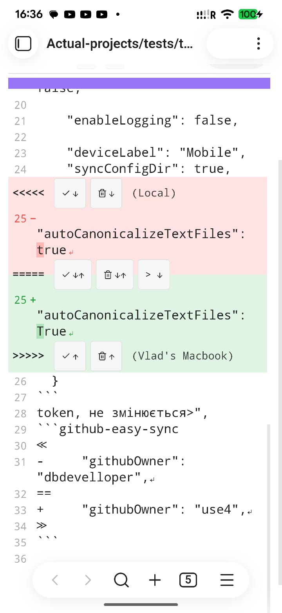

# I. TODO LIST

1. Додати інтеграційний тест: підряд, через 300 мсек — робити 3–5 sync (створюється новий файл з тестовими даними й
   робиться sync, але так швидко, щоб нові BATCHES з'являлися швидше, ніж відпрацьовує sync на одному BATCH. Має
   з'явитися
   кілька записів в .push-queue, і вони всі до кінця Драін повинні зникнути, а на тестовому GitHub має з'явитись усі ці
   файли, які передавались у цих sync-ах.

2. Такий самий тест, але зміни (одна зміна — один рядок) уносяться в один і той самий файл — має з'явитись 3–5
   комітів,  
   де ПОСЛІДОВНО буде збільшуватися число рядків у цьому файлі на GitHub. Перевірити останні 3–5 комітів цього файлу
   на GitHub і переконатись, що нічого не пропало.

3. Розфарбовувати назви файлів у дереві Obsidian нашим plugin-ом (це можливо?) — наприклад, `.gitignore` файли фарбувати
   світло-сірим кольором, а всі conflict-sibling-файли — червоним кольором.

4. ЗАСТАРІЛО! Додати в контекстне меню каталогів Obsidian пунк меню: ".gitignore" — відкривати й редагувати `.gitignore`
   для цього каталогу (потрібно робити свій текстовий редактор на CB6 для цього, чи Obsidian може і сам такі файли
   відкривати?) Якщо `.gitignore` не існує — створювати його порожнім, або з шаблонним коментарем з поясненням як його
   правильно заповнювати. Якщо користувач закриває його без змін (порожній, чи тільки шаблон) — не зберігати зміни
   (тобто не зберігати сам файл, тобто — видаляти). Якось так...
   Не зрозуміло, як видаляти `.gitignore` з каталогу. Можливо, якщо користувач видалив з нього УСІ
   записи (він порожній, хіба що пробіли та LF є) — тоді його автоматично видаляти? Але, через те що
   `.gitignore` за цим сценаріє видаляється автоматично, коли спорожніє — його немає змісту класти
   в `.runtime/trash/` (він і так уже порожній), і головна надія на його відновлення — тільки з GitHub
   repo (бо `.gitignore` потрапляють в repo, а отже потраплять в deleted list нашого plugin)?
   Напевне, було б добре управляти додаванням ".gitignore" пункту меню в контекст-меню тек Obsidian в Settings
   плагіну (OFF by default!) — objection: більшості людей це взагалі не потрібно, а "бувалі" користувачі можуть
   відкрити `.gitignore` на файловій системі використовуючи інші засоби операційної системи, фактично пункт меню
   ".gitignore" може бути корисний тільки на мобільній платформі, де інші засоби редагування `.gitignore` обмежені,
   а сам Obsidian приховує dot-файли/каталоги взагалі. До речі, з того факту, що Obsidian приховує dot-файли/теки
   випливає, що цей механізм редагування `.gitignore` обмежений тільки `<root>` та іншими доступними користувачу
   каталогами, а редагування `.gitignore` наприклад в каталозі `.obsidian` через цей механізм — неможливе.
   Користувач (просунутий) повинен сам розв'язувати цю проблему, якщо вона в нього колись виникне!

   НОВА УМОВА: Так, як в нас насправді є тільки root `.gitignore` (.gitignore в `.obsidian/**` до уваги не беремо, як і в
               попередній умові). Тож ми можемо додати функцію (кнопку) редагування цього root `.gitignore` (який ЗАВЖДИ
               ПРИСУТНІЙ!) як звичайний текстовий файл з Plugin's Settings. Це значно спрощує цю роботу.
               Пропоную для редагування root `.gitignore` використовувати наш же diff-editor (якщо зможешмо/варто його 
               так нестандартно використати й іншого plain-text editor в Obsidian для редагування дот-файлу .gitignore 
               не знайдемо. Для цього для лівого і правого файлу подаємо один і той самий файл. Тоді 
               конфліктів не буде, а увесь інший функціонал редактора буде збережено). Також в settings можна додати
               кнопки '.gitignore history' — і показувати звичайний список history цього файлу, як і для звичайних 
               файлів, щоб користувач міг побачити попередні значення цього файлу і працювати з ними.
               Objection: `.gitignore` це dot-file, який не видно з самого Obsidian, тому такий обхідний шлях дозволить
                          працювати з ним як з ordinal file. Особливо на мобільних пристроях. На desktop його можна 
                          редагувати засобами OS.

5. ✅ DONE. Зберігати persistent ознаку "token expired" у вигляді файлу-мітки `token_expired` в каталозі
   `.obsidian/plugins/github-easy-sync/.runtime/`, який витирати після відновлення зв'язку. Ми точно знаємо точки, де
   виникає
   ця помилка (або пропадає, бо зв'язок установлено успішно) тому можемо абсолютно точно встановлювати цей файл чи
   видаляти його. А потім цей файл можна читати і використовувати в Settings для показу відповідних повідомлень навіть
   без будь-яких перевірок, а також в statusbar menu (див. п.7 далі).

6. ✅ DONE. в statusbar зберігати рядок від нашого plugin в одному із цих виглядів:
    1. "GitHub" — нема COMMIT-BATCHES на надсилання на GitHub і нема конфліктів
    2. "GitHub (↑ 3)" — є три COMMIT-BATCHES на надсилання на GitHub і нема конфліктів
    3. "GitHub (↑ 3 | 20 ??)" — є три COMMIT-BATCHES на надсилання на GitHub і 20 конфліктів
    4. "GitHub (20 ??)" — нема COMMIT-BATCHES на надсилання на GitHub і 20 конфліктів

   NOTE: The conflict counter (🔀) забирається з status-bar — залишаємо тільки ({N} ??) template. Однак в ribbon має
   бути можливість додати іконку для відкривання diff-panel. В status-bar відкрити diff-panel можна буде з
   status-bar меню (п.7).
   NOTE2: "↑ 3" — зеленим кольором, "20 ??" — червоним кольором саме слово GitHub — звичайний колір (чорний), якщо
   нічого не відбувається, і зелений, коли виконується drain.

7. ✅ DONE: рядок "GitHub*" в statusbar повинен бути "клікабельним" і показувати statusbar меню, яке для
   неініціалізованого
   github-easy-sync plugin повине мати два рядки (схоже як стандартний неініціалізований плагін Sync). Назва
   "GitHub Easy Sync" береться з manifest.json, не констатна назва):
   ```
   GitHub Easy Sync: Uninitialized  # сірим кольором (перевірка settings GitHub token/Owner/Repository/Repository branch на поржні значення)
   -------------------------------
   Settings
   ```

   також тут може бути повідомлення про expired token
   ```
   GitHub Easy Sync: Token expired              # сірим кольором (якщо існу єфайл .token_expired десь в plugin/github-easy-sync)
   -------------------------------
   Sync All                                     # завжди commit + drain незалежно від значення в Settings
   Commit all changed files
   Commit current file
   Pull from repo and push stored (3) commits   # додавати рядок "({N})" тільки якщо є stored COMMIT-BATCHeS
   Open diff-panel (2 open conflicts)           # додавати рядок "(1 open conflict)" коли N==1, а "({N} open conflicts)" тільки якщо N>1
   -------------------------------
   Settings
   ```

   Якщо помилок нема, першого рядка меню не буде, як і розділювача після нього:
   ```
   Sync All
   Commit all changed files
   Commit active file
   Pull from repo and push stored commits
   Open diff-panel
   -------------------------------
   Settings
   ```

8. ✅ DONE: Якщо навести курсор мишки на Sync-іконку на ribbon, то побачимо alt-текст-підказку "Sync with GitHub".
   Пропоную, якщо в черзі є коміти (на іконці зображене число, нехай (3)), цей текст писати тоді так:
   "Sync (3 commits) with GitHub". Тоді ця підказка ще й допоможе користувачу зрозуміти значення числа на іконці.
   Він побачить однакове число і на іконці, і в alt-підказці і зрозуміє, що "3" — це не число файлів, а число комітів.

9. ✅ DONE: Схожа на (п.8) ситуація з іконкою "diff-panel", на якій також може показуватись число, і це число незакритих
   конфліктів. alt-текст-підказки має для неї зображати "Diff-Panel" чи "Diff-Panel ({N} open conflicts)".

10. ✅ DONE:
    видно чиї це Settings, і версію. Може ще бути посилання на GitHub repo десь маленьким лінком типу "(repo)"
    Брати такі значення з manifest.json:
    ```
      "name": "GitHub Easy Sync",
      "version": "2.0.2-beta",
      "authorUrl": "https://github.com/dbdeveloper/github-easy-sync",
    ```
    "{name} {version} ([repo]({authorUrl}))"
    буде щось таке:
    "GitHub Easy Sync 2.0.2-beta (repo)"

11. ✅ DONE: До речі, а diff-editor толерує файли з `\r\n`, а не тільки `\n`? Що станеться, якщо користувач відключить
    auto-canonicalize і в файлах будуть такі закінчення рядків?

12. Internationalization. Переклад повідомлень plugin на різні мови (мінімум: Українська, Німецька, Єврит, НІКОЛИ НЕ
    РОСІЙСЬКА!)

13. RTL (Right-To-Left) — для природної підтримки Івриту та інших мов, де написання іде з права-на-ліво.

14. ✅ DONE: Ідея від Obsidian sync: Removed spinning from the status bar icon because it impacted battery life when the
    app
    idles.
    Думаю, що варто додати в Settings таке налаштування, щоб вмикати/вимикати це крутіння. Воно гарне і наочне, але
    справді не обов'язкове. Хоча на mobile його і так нема (принаймні я не ба. А від батареї я працюю дуже рідко.
    Однак не я один користувач свого plugin, тому я б додав цю зупинку в Settings.

15. ✅ DONE: F3 / Shift+F3 у diff-editor search. Зараз `diff-pane-v2.ts:787` вішає лише дефолтний
    `searchKeymap` (`Mod+G`/`Shift+Mod+G` next/prev, `Mod+F`, `Esc`) — F3/Shift+F3 не прив'язані.
    Додати `{key:"F3", run:findNext}` + `{key:"Shift-F3", run:findPrevious}`. Загальна фіча (усюди в
    diff-editor); заодно потрібна для History-проброса пошукової фрази (див.
    `docs/tasks/HISTORY-DELETED.md` §4.6).

16. Протестувати Settings->Reset Plugin. Він, зокрема, повинен закривати УСІ ВІКНА, відкриті нашим плагіном і
    повністю очищати каталог `.obsidian/plugins/<plugin-id>/.runtime/` перед повторною ініціалізацією.

17. ✅ DONE: В diff-editor сторону, яка представляє Vault-file (в conflict mode це - `base-file`) підписувати
    (ver-blocks, hints кнопок) не <local deviceLabel>, а просто словом — "Local" ("Actual" для режимів history/deleted).
    Так значно зрозуміліше. Особливо, якщо користувач не змінить deviceLabel на різних машинах і залишить "Obsidian".
    В цьому випадку буде порівняння типу: "Obsidian" vs "Obsidian" — що абсолютно не зрозуміло. Краще вже так:
    "Obsidian" vs "Local".
    Тут є нюанс: для conflict mode "Local" — це ver1-block (тобто "старі зміни, "-', ми ніби кажимо: "ми щось змінили
    локально, на цій машині ("Local"), але на сервері є "новіші" дані ("+"))!
    А для history/delete парадигма трохи змінюється. "Local" тут стає "Actual" і тепер вона знаходиться не в ver1-block,
    а в ver2-block — тобто ми ніби кажемо: "Actual — це найновіші дані, які ми додали у файл!" ("+"), тоді як
    "history чи deleted" — це "старі" дані ("-").

    Відповідно, diff-editor запускається в 2-х режимах: **Conflict** та **History/Delete**. І в цих режимах навіть
    написи на кнопках має бути різна!

    A. Для **Conflict**-режиму це кнопки:

    На toolbar ("Keep all", "Apply all", "> Join all"):
       ```
       [<-] [Keep all] [Apply all] [> Join all] <-(вирівняно вліво)|(вирівняно в право)->         Edit [x]
       Conflicts: [ ↑ ] [Undo]                  <-(вирівняно вліво)|(вирівняно в право)->        Auto-focus: [x]
          NNN     [ ↓ ] [Redo]                  <-(вирівняно вліво)|(вирівняно в право)-> Diff-mode: [Character]
       ```

    diff-group в тілі документу ("Keep", "Remove" для ver1-block (BASE-FILE, "Local"), "Apply", "Remove" для
    ver2-block (CONFLICT-SIBLING-FILE, "remote")):
       ```
           | <<<<< [Keep ↓][Remove ↓] (Local)
        1 -| <ours line 1>
        2 -| <ours line 2>
           | ===== [Apply ↓↑][Remove ↓↑][> Join ↓]
        1 +| <theirs line 1>
        2 +| <theirs very-long long very-long long very-long longvery-long long
           | very-long long very-long long very-long longvery-long long loooong
           | long line 2>
        3 +| <theirs line 3>
           | >>>>> [Apply ↑][Remove ↑] ({remote deviceLabel}) 
       ```

    B. Для history/deleted modes:

    На toolbar ("Restore all", "Keep all". NOTE: "> Join all" не показується навіть для markdown файлів!):
       ```
       [<-] [Restore all] [Keep all]            <-(вирівняно вліво)|(вирівняно в право)->         Edit [x]
       Conflicts: [ ↑ ] [Undo]                  <-(вирівняно вліво)|(вирівняно в право)->        Auto-focus: [x]
          NNN     [ ↓ ] [Redo]                  <-(вирівняно вліво)|(вирівняно в право)-> Diff-mode: [Character]
       ```

    diff-group в тілі документу ("Restore", "Remove" для ver1-block (History/Deleted), "Keep", "Remove" для ver2-block (
    Actual)):
       ```
           | <<<<< [Restore ↓][Remove ↓] (<YYYY-MM-DD hh:mm:ss>)
        1 -| <ours line 1>
        2 -| <ours line 2>
           | ===== [Apply ↓↑][Remove ↓↑]      # NOTE! [> Join ↓] removed even for markdown files!
        1 +| <theirs line 1>
        2 +| <theirs very-long long very-long long very-long longvery-long long
           | very-long long very-long long very-long longvery-long long loooong
           | long line 2>
        3 +| <theirs line 3>
           | >>>>> [Keep ↑][Remove ↑] (Actual) 
       ```

18. 'Use Disk-cache for files's history' property в Settings при переході з режиму "On" в режим "OFF" має видаляти
    весь кеш з диску. Так само перевірка цього режиму має відбуватись при старті plugin з такою ж дією. Таким чином
    перемикання цього параметру: ON->OFF->ON працює як скидання кешу.

19. Додати коментар (див коментар "HERE:") в `.obsidian/.gitignore` :
    ```
    # ===== github-easy-sync invariants — DO NOT EDIT =====
    # Editing this block triggers a rewrite to canonical on next load.
    
    # Per-device state — never propagate between machines.
    github-easy-sync-metadata.json
    workspace.json
    workspace-mobile.json
    community-plugins.json
    
    # HERE: це не "never propagate between machines" значення, це навпаки - дозвіл на збереження plugins/*/data.json на сервері!
    #       і цей параметр можна змінити в Settings, хоча він насправді буде змінений тут! Саме це потрібно тут в коментарі
    #       і написати! Цей параметр особливий - хоч він і знаходиться в Settings, але він не зберігається в data.json
    #       тому встановлений в Settings на одній машині, він одразу (після SYNC) стає таким самим на всіх Obsidian Vault,
    #       підключених до цього ж GitHub repo!
    !plugins/*/data.json
    # ===== end of invariants =====
    ```

20. Придумав ще "інверсію" пошуку у файлах історії файлу! — шукати не ті файли, де знайшлась певна фраза, а навпаки —
    ті версії файлу, де цієї фрази ще не було! Таким чином ми можемо знаходити файли, де певних термінів ще не
    зустрічалось!

21. ✅ DONE: Для швидкості перегляду history (і можливо deleted, і навіть можливо — conflicts!) — дозволити
    перевантажувати
    вже відкритий таб іншим вмістом без показу модального вікна "файл вже відкрито" (перевантажити відкритий
    таб з diff-editor з даними, які стосуються цього ж файлу) ЯКЩО ще не було у diff-файл, що показується в diff-editor,
    внесено жодних змін! Тобто, якщо спробувати відкрити інший diff-file для файла, який вже відкритий в іншому табі,
    то замість модального вікна "File already open in a diff-editor\n"<filename>" is being resolved in another
    diff-editor tab. Finish there first, or switch to it now", перевідкривати це вікно новим вмістом ЯКЩО і ТІЛЬКИ ЯКЩО
    у відкритому diff-editor ще не було змін. Якщо ж зміни вже були, тоді показувати модальне вікно:
    ```
    File already modified in a different diff-editor

    "<file>" is already being edited in another diff editor tab.
    Finish or revoke  your changes to open it in another conflict.
    
                                        [Go to that tab] [Cancel] 
    ```

22. Зараз контекстне меню "Open GitHub history" показує історію не тільки текстових файлів, але й бінарних.
    Це похвально, але для таких файлів варто придумати щось простіше, ніж відкривати бінарний файл в diff-editor.
    Може, для них варто показувати просто повідомлення про те, що це бінарний файл, і пропонувати зберігати його поруч з
    оригінальним файлом (з додатковими змінами в назві) і відкрити його в окремому табі, а його видалення залишати
    користувачу чи як інакше можна слідкувати за його livecycle?

23. DIFF-EDITOR for History/Deleted:
    До речі, продумай як будеш ще параметризувати diff-editor для history, щоб прокидати в нього параметри пошуку
    (пошукову фразу та значення checkboxes — []Aa, [].*, [] word). Почитай HISTORY-DELETED.md там про це сказано 24.
    Одночасно продумай момент, що якщо передано пошукову фразу, то в редакторі потрібно буде при запуску одразу
    ж шукати перше входження і скрлолити текст на це місце незалежно від того, чи встановлено Auto-focus чи ні. Тобто
    в history пошук по зовнішньій пошуковій фразі має вищий приорітет. І взагалі - (дискусійно) що для history/deleted 
    auto-focus буде зчитуватись з Settings. З великою ймовірністю він буде false by default, а користувач повинен 
    вмикати його руками кожний раз, як йому це знадобиться, aбо ж (можливо) auto-focus для різних режимів буде в Settings 
    прописано окремо (autofocus для conflicts, autofocus для history, autofocus для deleted)

24. ✅ DONE (2026-07-05). РЕАЛІЗОВАНО: `pendingConflictSummary` фільтрує → лише tracked base-шляхи; synthetic-only →
    null → sync без модалки; список tracked cap-5+"…"; `[Resolve]` → `activateDiffEditView()` (панель, не sibling.md);
    текст plural за 2 осями (файли × tracked-конфлікти на файл); NOTE-глосарій tracked vs synthetic. Лічильники (badge)
    не зачеплено. Деталі — DIFF2_IMPLEMENTATION_PLAN.md §R2.6 (блок §24).
    При sync, якщо є файли в конфлікті, видається повідомленян про ці файли й вказується їх число і навіть їх перелік
    (спитати що буде, як перелік буде на 100 файлів). Так-от — тут підраховуються і синтетичні і tracked конфлікти,
    АЛЕ насправді повідомлення "Files in conflict are not visible on other device until you resolve them." стосується
    ТІЛЬКИ tracked конфліктів! Синтетичні конфлікти ніяк не впливають на процес розв'язання конфліктів, ініційованих
    git. Синтетичні конфлікти — це може бути "відголос" вже закритих конфліктів (перенесли файл в інший каталог,
    конфлікт "завершився" типу видаленням файлу, а "синтетичний" конфлікт насправді ще тягнеться, хоча сам GitHub repo
    про це нічого не знає).

25. Зараз перенесення diff-editor з одного split в інший іде через перевідкриття і restore з диска. Можливо, краще
    зробити перенесення в пам'яті. Там, видно, є проблеми з UNDO-stack та іншими механізмами. Це так — "хотілка" на
    далеке майбутнє.

26. ✅ DONE: Є ще один неоднозначний момент — файл в tracked conflict постійно показується як модифікований і намагається
    всунутись в усі коміти (навіть якщо не змінюється), але при sync відсікається. base-file в tracked conflict
    також абсолютно легітимно може потрапити в коміт і закомітитись в merge-бранч, а не в основну гілку, тому якщо
    в нього внести зміни, він повинен показатись як додатковий коміт, але тільки якщо є зміни. Якщо нема, про його
    присутність тільки вказує нагадування при кожному sync, що в Vault ще є tracked конфлікти, які варто розв'язати,
    інакше на інших devices ці зміни не відображаються.

    Ще раз: Маючи цей конфлікт, якщо я клацаю на commit (local) то отримую коміт з цим `test.md` файлом. Але ж цей файл 
    під конфліктом і НЕ МОДИФІКОВАНИЙ!!! Тому sync — нічого не робить. Потрібно розібратись, ЧОМУ НЕМОДИФІКОВАНИЙ файл 
    під tracked conflict кожний раз пхається в `push-queue/`. До речі він і зараз там (я не робив sync). Obsidian Vault:
    `~/Obsidian`. Дивись логи і каталог `.runtime`

27. ✅ DONE: Налаштувати розмір і текст кнопок в diff-panel/diff-history/diff-deleted/diff-editor для нормального показу
    на
    мобілці (зараз не все чудово)

28. ✅ DONE (2026-07-15, branch `diff2`, commits `b71559c`→`0486c77`; build + 1862 unit green). Плагін-каталог більше 
    НІКОЛИ не породжує `*.conflict-from.*`: `pluginDirFileRole`+`resolvePluginDirFile` (завжди atomic, ніколи register). 
    Coupled-bundle {main.js,*.js,manifest.json,styles.css} → ОДИН переможець на plugin-id (semver → канонічний 
    bundle-mtime, спільний для всіх → група не «розколюється»); `styles.css` СЛІДУЄ за переможцем bundle (правило 1), а 
    власний mtime лише коли bundle однаковий з обох боків (правило 3); `data.json` → лише mtime (правило 4); повний 
    tie → theirs; delete-vs-modify плагін-файлу → resurrect. Pull-side: pre-apply-snapshot (`pullBundleSnapshots`) щоб 
    порядок застосування не «розколов» групу. gitignored плагіни фільтруються ДО §28 (`isSyncable`), власний `data.json` 
    (з токеном) — hard-excluded. Тести: pure resolver (group-atomicity lock) + manager-combos на РЕАЛЬНОМУ 
    vault+gitignore + integration E5. Деталі — BUILDLOG §28 / SYNC2 §7.11 / PSEUDO §6. Нижче — оригінальний опис.

    Зловився diff-conflict в plugin-каталозі. Це — дупа. Там не повинен ловитись конфлікт. хіба що в data.json. Решта
    файлів мають змінюватись атомарно. Тобто ВСІ ТРИ ФАЙЛИ плагіну (manifest.json, main.js, styles.css) замінюються
    разом! Якщо є зміни в локальному файлі styles.css, але з сервера йде оновлений main.js, а manifest.json, наприклад,
    не змінився, тоді з сервера тягнеться й styles.css, і перезаписує локальний `styles.css` навіть якщо його дата раніше
    за локальний styles.css. Чому? Бо змінений main.js може вимагати нових стилів, щоб коректно працювати.
   Тобто при колізіях правило таке:
    1. на якій стороні змінився manifest.json+main.js, з цієї сторони і тягнемо styles.css
    2. якщо змінився тільки styles.css на одній стороні (немає конфлікту), тоді він пропагується на іншу сторону
    3. якщо є конфлікт styles.css і п.1 цього правила НЕ ПРАЦЮЄ, тоді "перемагає" той styles.css, дата модифікації якого
       ПІЗНІША.
       ГОЛОВНА ЗАДАЧА ЦИХ ЗМІН: НІКОЛИ НЕ МАТИ *.conflict-from.* файлів в плагінах!
    4. для файлів data.json ЗАВЖДИ при конфліктах працює правило: перемагає та сторона, дата модифікації якої ПІЗНІША.

29. ✅ DONE: На мобілці не працює копіювання diff-groups. Вставляється текст замість групи:
    

30. ⏸️ DEFERRED (2026-07-13, платформне обмеження — user: "лишаємо як є, normal-lines+one-diff-group для мобілки
    достатньо"). На мобілці з допомогою tap-scroll неожливо продовжити виділення тексту за межами diff-group. Тобто якщо
    почати
    виділяти текст або на першому символі ver1-block diff-group, або ще раніше, в normal lines довкола diff-group,
    і продовжити виділення diff-group, то сама група чудово виділяється, але після цього виділення зупиняється, і вже
    ніякими жестами неможливо продовожити виділяти normal lines з другого боку даної diff-group. Цікаво чи це можна
    виправити?

    ── ДІАГНОЗ (device-traced, щоб наступна спроба не повторювала весь трейс) ──
    • DESKTOP-миша працює (наш `EditorView.mouseSelectionStyle`→`zoneAt`+`mouseDragSelection`→`legalizeSelection`,
    рахує позиції з координат). MOBILE не працює: touch-виділення веде НАТИВНИЙ selection-handle (pill),
    а `mouseSelectionStyle` на touch НЕ спрацьовує.
    • Корінь: маркери `<<<<<`/`=====`/`>>>>>` — це block-widget'и (`Decoration.widget({block:true})`), і нативна
    ручка НЕ може перетягнутися крізь block-widget. Голова виділення застрягає ВСЕРЕДИНІ групи (device-trace:
    head впирається в межу групи, ніколи не виходить за `v2.to`/`v1.from`). Симетрично для обох боків.
    Легалізатор ні до чого — desktop через нього ж проходить.
    • ❌ A2 (CSS `user-select:none`→`text`и на маркері) — НЕ допомогло: block-widget сам блокує ручку, не user-select.
    • ❌ Option Gр (перехопити touchmove→`posAtCoords(палець)`→`legalizeSelection`→dispatch+preventDefault):
    🔑AНА(ЦЬОМУ ПРИСТРОЇ `:ouchmove` НЕ cancelable (`cancelable=false`) → `preventDefault` = no-op (той самий клас,
    щоOне-ca celable beforeinput у §29). `pointermove` cancelable=true, але native все одно перебиває через
    не-cancelable touchmove у пер-кадровій гонці (dispatch тримається один кадр, потім native повертає). Тобто
    і G-by-prevention, і G-by-correction (пер-кадрове пере-ствердження) мертві.
    • Єдине, що працює: наш dispatch «прилипає», коли native НЕ тягне активно (lift+tap за групу → розширює один раз).
    • ЯКЩО КОЛИСЬ ПОВЕРТАТИСЬ — лишились тільки: (a) "correct-on-release" (на touchend розширити один раз через
    legalize, якщо голова на межі + палець за нею; частково, без живого фідбека/автоскролу); (b) повний A —
    ВИМКНУТИ нативне виділення (`user-select:none`+`touch-action:none` на .cm-content) і збудувати власну систему
    (long-press, автоскрол, власні ручки/кінці) — окремий великий проєкт. Advisor+Claude рекомендували проти повного A.

31. ✅ DONE (2026-07-13). Дуже прикольний баг! - Коли в Settings встановити для diff-editor "Edit-mode": OFF, тоді при
    recovery не програються
    зміни й файл НЕ ВІДНОВЛЮЄТЬСЯ після збою!!! (replay не відбувається — файл залишається незмінним). Тобто "read-only"
    mode спрацював навіть на replay (а не мусив)! Помилка проявляється як на мобільному пристрої, так і на desktop.
    ПРИЧИНА: touch-only `changeFilter` (`diff-pane-v2.ts`) ріже input/delete userEvents, а recovery-replay
    re-dispatch-ить записані правки з userEvent "input.type" → в read-only їх блокувало. ФІКС: фільтр тепер
    пропускає транзакції з анотацією `replayDispatch` (дзеркалить diff-edits/diff-auto-resolve). Анотація стоїть
    ЛИШЕ на replay-dispatch-ах, не на живих правках → read-only для користувача лишається. Тести (RED-GREEN):
    recovery-forward.test.ts — replay у touch-only view відтворює правку; живий edit у touch-only лишається
    заблокованим.

32. ✅ DONE: Відкриття diff-editor часом може займати певний час. Особливо якщо багато змін і diff "задумався" чи при
    replay
    після аварійного закриття табу (replay досить повільний, бо неоптимальний (p.II)). При цьому видно порожній default
    diff-editor toolbar і створюється відчуття, що Obsidian — "завис". Щоб не було такого відчуття, пропоную при старті
    diff-editor-tab:
    1. не показувати toolbar аж до повного завантаження даних для показу;
    2. показувати "крутилку" типу "loading...", яка замінюється повним вмістом diff-editor, коли всі дані готові.

33. ✅ DONE (2026-07-13): `.diff2-marker-top { flex-wrap: wrap-reverse; }` — для `<<<<<` (ver1) перенесений label
    іде ВГОРУ над panel (uniform, лише перенесений випадок; `>>>>>` не зачеплено). Чи можна правилами CSS перенести div
    не вниз, а вгору? :) Або в інший спосіб реорганізувати ver1-block, коли label
    переноситься на окремий рядок?
    Нам потрібно розв'язувати таку проблему з ver1-block ONLY (!!!):
    якщо label (ЦЕ СТОСУЄТЬСЯ ТІЛЬКИ LABEL!!!) в ver1-block ONLY(!) при розрахунку відмічається, як така, що буде
    переноситись на ОКРЕМИЙ рядок, тоді ver1-block малювати з іншим layout. А саме — зробити його з двох рядків:

    Хочу, щоб у такому випадку label переносився "вгору" над panel, як тут:
    ```
       <label>
       <<<<< [Keep ↓] [Remove ↓]
       ===== [Apply ↓↑] [Remove ↓↑] 
       ...
    ```
    Objection: зараз є конфуз, коли маємо порожній ver1-block з перенесеним <label> вниз. Можна подумати що цей
    `<label>` і є текстом у ver1-block:
    ```
       <<<<< [Keep ↓] [Remove ↓]
       <label>
       ===== [Apply ↓↑] [Remove ↓↑] 
       ...
    ```

34. Зараз підготовка diff-document для показу в diff-editor відбувається синхронно в UI-thread, і на великих файлах
    весь Obsidian "підвисає", поки завантажується цей документ. Продумати, чи можна цю підготовку відправити в
    webWorker.

35. ✅ DONE (2026-07-15, branch `diff2`, коміти `e8ba373`→`ab9f486`; build+unit green, розгорнуто на десктоп;
    перевірку mobile-модалки користувач робить сам). Реалізовано: липка засувка (успіх НЕ скидає — скидають лише
    зміна token/owner/repo або успішний Test-probe); pre-flight gate перед КОЖНОЮ операцією з GitHub API
    (user→модалка без throttle, auto→notice "Sync skipped: token expired" 2с); класифікація 401/403
    (`invalid`/`scope`) з персистом тегу у файл-мітці й відновленням тексту після reload; картка "GitHub sync status"
    повністю marker-driven для auth; disable Sync All/Pull-push у меню; червоні statusbar "GitHub" + ribbon-Sync з
    tooltip "Token expired" + відновлення на старті; "TOKEN EXPIRED!" у diff-history-view; коротша mobile-модалка.
    Деталі — BUILDLOG.md запис §35. Нижче — оригінальний опис завдання.

    Коректно повідомляти "GitHub Token expired". Зараз це відбувається не "консистентно".
    Зараз, коли при синхронізації приходить помилка "token expired", створюється файл-мітка
    `.obsidian/plugins/<plugin-id>/.runtime/token_expired`. Ідея була така: перед кожним доступом до GitHub перевіряти
    цю мітку і видавати помилку-token_expired усюди в ONLINE і OFFLINE. Але ми помилково вирішили скидати цю мітку
    при наступному успішному доступу до GitHub. Насправді, основною "ground truth" є тільки саме поле token в Settings!
    Отже, якщо ми отримали помилку `token expired` і встановили файл-мітку `token_expired` з цього моменту ми ЗАВЖДИ
    перевіряємо присутність цього файлу-мітки ДО всіх операцій з GitHub API і припиняємо обробку, якщо цей файл
    присутній. Objection: ця помилка вже ніколи не зникне, поки НЕ ЗМІНИТИ ТОКЕН НА ІНШИЙ! Отже, скидання цього токену
    ми здійснємо ТІЛЬКИ КОЛИ КОРИСТУВАЧ ЗМІНИВ ТОКЕН НА ІНШИЙ! Ось тоді ми видаляємо цей файл-мітку і знову готові
     перевірити, чи в нас з'явився доступ. Це означає, що як тільки ми замінили токен, будь-яка операція з GitHub API
    знову стає досяжною і, отже, ми можемо знову отримати помилку. Це може бути будь-яка помилка з API (наприклад Timeout
    Error — нема інтернету, чи інша) але, ТІЛЬКИ КОЛИ МИ ЗНОВУ ОТРИМАЄМО ПОМИЛКУ 'token expired' — процес повторюється:
    ми знову створюємо файл-мітку `token_expired` і знову дозволяємо доступ до GitHub API. Це — найлогічніший спосіб
    управляти цим циклом.
    Друге. Потрібно одноманітно реагувати на присутність файлу-мітки "token_expired" при різних ситуаціях. Зараз
    найкраще виглядає реакція на цю мітку в toolbar "GitHub" menu: там з'являється повідомлення "Token expired" що
    однозначно показує помилу. Єдине що я б ще додав — зробив "disabled" пункти меню "Sync All" і
    "Pull from repo and push stored commits" на момент присутності файлу-мітки "token_expired" в папці `.runtime`
    плагіну.
    Ще б я змінював при цьому колір слова "GitHub" в statusbar на червоний.
    Також хотілось би, щоб колір іконки "Sync" в ribbon також змінювався на червоний, його hint містив повідомлення
    "Token expired" і клац по цій іконці завжди викликав появу модального вікна:
    "GitHub Easy Sync — GitHub token expired or invalid".
    Зараз це модальне вікно з'являється, але якщо його закрити ([X]), тоді при наступному "Sync" воно вже не з'являється
    (а мусило б!), а тимчасово виникає випливаюче повідомлення: "Error syncing. kt: Failed to get branch head sha,
    status 401".
    Третє: коректне повідомлення про "token expired" має з'являтись і коли ми тягнемо список історії файлу
    (diff-history-view), чи deleted files з GitHub. Зараз там виникає тільки помилка:
    "Couldn't load GitHub history – showing local unpushed version only". Але якщо присутній файл-мітка "token_expired",
    то помилка мала б точно вказувати на помилку:
    "TOKEN EXPIRED! Couldn't load GitHub history – showing local unpushed version only"

    ТОБТО — УСІ ВЗАЄМОДІЇ З GITHUB API мають починатись з перевірки присутності файлу-мітки "token_expired" в папці
    `.runtime`

    Ще один момент — всі помилки з токеном (expired, wrong) породжують файл "token_expired". Цього досить(?).
    Питання: Чи можна ТОЧНО ідентифікувати, коли токен expired, a коли саме token — wrong? В такому випадку, може
    створювати файл-мітку "token_expired" з size 0 (expired) і 1 (e.g. "1" всередині) — "token wrong"? Якщо ж
    важко розрізнити ці два випадки, тоді нехай буде просто файл-мітка "token_expired" з нульовою довжиною на всі 
    випадки (перевірити і перепитати це в advisor).

    І ЩЕ: Червоний колір іконки Sync в ribbon і слова "GitHub" в statusbar повинні відновлюватись при старті програми, 
          якщо файл-мітка "token_expired" все ще присутній в `.runtime/`.

    Важливе доповнення! Автоматичні операції (такі як Sync при старті Obsidian+github-easy-sync plugin), чи періодичні
    sync, бо встановлено в settings "Sync strategy": "On interval" при наявності файла-мітка "token_expired"
    в `.runtime/` відбуваються "тихо", тобто без показу модального вікна 
    "GitHub Easy Sync — GitHub token expired or invalid", єдине що вони показують, так це короткочасне випливаюче 
    повідомлення "Sync skipped: token expired" замість "Sync done".

    TEST в "Settings" – це єдине місце, яке абсолютно не залежить від файлу "token_expired", і так, успішне виконання test в settings також здатне прибрати цей файл, тільки цього швидше за все ніколи не             
    станеться, якщо не змінити token.

    І ще одне: якщо sync "впав" через те, що "token expired", він більше не повторюється (нема змісту) - а швидко 
    завершується при ітеративному виклику (ribbon, commands) - з появою modal dialog, автоматичний запуск -
    появою короткочасного випливаючого повідомлення: "Sync skipped: token expired" замість "Sync done".

    І ще - дві різні версії модальних вікна ""GitHub Easy Sync — GitHub token expired or invalid":
      1. (так що є) Для desktop
      2. коротша і менша - для mobile devices
   
36. В Settings, секція "Logging", Підсекція "Clean logs" чи можна в description замість тексту "Truncate the log to 
    0 bytes" вказувати "Truncate the log. Current log size is NNN bytes." І NNN — це реальна довжина лог-файлу, яка
    ще й диманічно змінюється, якщо лог в цей момент росте. Тоді, якщо клікнути по кнопці [Clean] в цій під-секції,
    то NNN = 0, і користувач одразу ж "повірить" (бо побачить!), що лог truncated. Це діє краще за 1000 слів!

37. З метою спростити settings, пропоную все ж відмовитись від окремих параметрів "auto-focus" для різних випадків
    використання diff-editor (conflict, deleted, history) і залишити тільки один на всіх їх. Навіть, якщо мати окремі
    налаштування було б зручно, але, гадаю, більшість користувачів не оцінять цю складність і будуть користуватись одним
    режимом усюди, щоб все для них було "одноманітно". Тому одного "auto-focus" параметру в Settings має вистачити.

38. Налаштувати автоматичне вирішення конфліктів в каталозі `.obsidian` на користь новішого mtime. Видно, давати
    користувачу вирішувати конфлікти в цьому каталозі немає змісту. Їх потрібно вирішувати по принципу — "що новіше, те
    й беремо"! Якщо користувачу цей підхід не подобається, тоді нехай виключає синхронізацію цього каталогу в Settings.

39. Видно, файли конфліктів взагалі не обробляються, якщо вони знаходяться в каталогах, які починаються з "." (приховані).
    Я розумію про ".git", чи ".obsidian" (п.38), але про інші — це так не має працювати!
    Для перевірки я створив каталог `.test` в `~/Obsidian-test` і вставив туди файл `test.md` з sibling-conflict-file.
    І цей синтетичний конфлікт не з'явився в diff-panel/Conflicts!
   
40. ✅ DONE. Фундаментальна помилка! Зараз в мене в Obsidian vault: `~/Obsidian-test` спеціально прострочений токен (token 
    expired) і я знайшов цікавий баг: Я роблю commit і створюється commit (я не відправляю, бо не можу), я створюю ще 
    один, нічого не змінюючи й створюється ще один, ... і ще ... і ще... Схоже всі вони містять ОДИН І ТОЙ САМИЙ КОД —
    (Принаймні останні 6 чи 7 з них! — дивись `.runtime/push_queue`). Але як це може бути з нашими тотальними тестами й
    чітко вибудованими сценаріями: якщо змінені файли потрапляють в commit (push_queue), вони НЕ МОЖУТЬ ПОТРАПИТИ В 
    НОВИЙ КОМІТ, ЯКЩО НЕ БУЛО ЗМІН???? АЛЕ Ж ЗМІН НЕМА????? В чому проблема тоді?
    проаналізуй логи ~/Obsidian-test та вміст `.runtime/` цього vault.

41. ✅ DONE. Пробую створювати з нуля Vault і GitHub репозитарій (покроково, для документації). Стикнувся з помилкою:
    1. створив новий Obsidian Vault: `/Users/dbdeveloper/My Obsidian Vault`
    2. створив новий private GitHub repo (з нуля, без README, без .gitignore, без license) - `My-Obsidian-Vault`
    3. створив для нього fine-grained key
    4. встановив в Obsidian Vault "My Obsidian Vault" plugin "BRAT" і через нього встановиви github-easy-sync плагін
       з мого repo
    5. зайшов в Settings плагіну github-easy-sync і встановив правильні значення "GitHub token", 
       Owner ("new-username12345"), Repository ("My-Obsidian-Vault") і Repository branch ("main").
    6. запустив [test] і отримав помилку — див. docs/tasks/imgs/bug-60-1.png (і здавалось би, що 
       це правильно, бо такого branch ("main") ще в GitHub repo немає (він нульовий). Однак! Якщо я 
       витираю поле "Repository branch", і тисну [test], тоді тест проходить успішно! — 
       див. docs/tasks/imgs/bug-60-2.png (і це теж правильно! бо ми перевіряємо з'яднання з GitHub, 
       і він "Зелений", хоч branch "main" ще не існує. Цікаве те, що в повідомленні про успішне з'єднання 
        вказано, що "Default branch: main"!
    
    Отже, потрібно доробити цей тест так, щоб він дозволяв для порожнього репозитарію вказувати довільний branch
    (а якщо користувач залишає його порожнім — має проставлятись main) і при порожньому repo не видавати помилку, з
    будь-яким іменем branch, яке введе користувач (бо цей же бранч і буде створено при першому sync,
    Треба створити для цього додаткові інтеграційні тести (можеш їх сам запускати, бо є .env.test).

42. Продумати, як реагувати на конфлікт між бінарними (не текстовими) файлами. Однозначно, що в diff-panel/Conflicts
    ці файли не повинні відкривати diff-editor, а, можливо, і взагалі там не відображатись. Тобто їх вирішення можливе
    тільки у файловому режимі (видалення конфлікт-файлу, чи перейменування його на base-file). "порівняння" також
    тоді відбувається тільки через відкриття base та conflict файлів в окремих вікнах/табах з візуальним порівнянням.

43. Продумати, як якісно знаходити синтетичний конфлікт між дозволеними dot-файлами і конфлікти в dot-каталогах. Зараз
    вони взагалі невидимі. tracked конфлікти чисто теоретично ще легко уявити, бо вони зберігаються в конфіг-файлах, 
    отже ми про них вже щось знаємо. А ось dot-файли... Хіба також додати правило — конфлікти між dot-file вирішувати
    тільки у файловій системі й методами OS, а не Obsidian (бо в Obsidian вони невидимі!). 

44. Log-файл, який ми зберігаємо в корні Vault має розширення `*.log` і не відкривається стандартними засобами Obsidian.
    Одночасно зараз цей лог – це по суті NDJSON-файл, який можна перетворити на md-файл з однією великою відсортованою 
    за timestamp-таблицею, в якій кожний рядок являє собою запис з логу. Пропоную в Settings додати кнопку для перегляду 
    логу, і при цьому генерувати тимчасовий md-файл і відкривати його як звичайний md-файл (readonly, якщо можливо).
    Також варто дати можливість користувачу за потреби копіювати з цієї таблиці записи в clipboard. Сам файл в корні 
    Vault (`github-easy-sync.log`) користувач може відкривати іншими засобами або копіювати, перейменовувати/видаляти як 
    заманеться. До речі, останнє (delete)) має якось детектитись системою логування, щоб це не зупиняло логування, а 
    одразу ж створювався новий лог-файл, якщо в settings увімкнено логування. Цей файл не dot-file, тому ondelete його 
    втрату побачить одразу.

45. В settings в editbox "GitHub token", якщо по ньому клацнути, то він автоматично робить select-all, щоб зручно було 
    повністю замінити токен на новий такою дією: "клацаємо по edit-box зі старим токен, він виділяється повністю, робимо
    "paste" (ctrl+v) і новий токен повністю замінює старий. Але зараз (можливо через дризжання клавіш моєї мишки) токен 
    виділяється повністю, а потім це виділення часом зникає. Це поле ("GitHub token") також має два режими показу: 
    за замовчуванням вміст цього поля прихований, і щоб побачити вміст, потрібно клацнути по клавіші "show" 
    (іконка "око"). Пропоную в режимі "hiden" ЗАВЖДИ виділяти увесь вміст цього поля (select-all), якщо це зроблено
    мишкою при "hidden" режимі, а не клавішами управління курсором. А ось коли режим "show", тоді клацем мишки дозволити
    вставляти курсор в певну позицію (якщо фокус вже був на цьому полі). Тобто — при отриманні фокуса і клац мишкою 
    по цьому полю (при отриманні фокуса) — завжди робити "select-all", а при повторному клацу мишкою при режимі "show" 
    вже встановлювати курсор у певну позицію. якщо режим "hidden" — всеодно все поле залишається повністю виділеним — 
    "select all").

46. дізнатись, куди веде `helpUrl` в manifest.json плагіну. І як оформлювати сторінку, куди він веде. 

47. Дивний код у детекторі змін: watermark-гейт `change-detector.ts:211-233` схоже що не робить нічого. Знайдено
    2026-08-05 збоку, при дизайні ping-pong сховища (`SYNC2-METAFILE-REFACTOR.md` §2); у код не лізли.

    ЯК ЦЕ ЧИТАЄТЬСЯ (без цього далі нічого не зрозуміло). `watermark` — це НЕ дата якогось файлу, а ГЛОБАЛЬНА
    мітка часу останнього коміту: усі чотири місця, що її пишуть, кладуть туди годинник, а не mtime
    (`setLastCommitMtime(this.now())` — `sync2-manager.ts:1198, 1462, 1916, 3823`). Одне число на весь vault.
    Головне: умова `mtime <= watermark` — це гілка «файл НЕ чіпали від останнього коміту», а не навпаки:

        t=5    юзер редагує note-A.md   → mtime(A) = 5
        t=10   коміт                     → watermark = 10
        t=12   юзер редагує note-B.md   → mtime(B) = 12
        t=15   findChanges() біжить
        note-A:  5 <= 10 → ТАК → гейт спрацював → дешевий пропуск
        note-B: 12 <= 10 → НІ  → повний шлях → read + SHA → `modified`

    Тобто гейт існує заради файлів, яких НЕ чіпали: у vault на 20k одразу після коміту майже всі 20k мають
    `mtime <= watermark`, а `>` мають лише ті кілька, які щойно редагували. Сенс задуму — «оці 19 995 навіть
    не дивимось».
    Чому `<=`, а не `!=`: watermark ГЛОБАЛЬНИЙ, а не per-file. `mtime != watermark` було б істинним практично
    для кожного файлу (збіг із міткою коміту з точністю до мілісекунди майже не трапляється) → гейт не
    спрацьовував би ніколи. Рівність має сенс лише проти PER-FILE записаного значення — і саме це робиться
    на `:218-222` та `:276-284`. Два різні питання до двох різних величин: `<=` проти глобальної мітки —
    «чи були зміни після коміту», `===` проти снапшота — «чи це точно той стан, який ми записали».

    Гейт `if (watermark !== null && file.stat.mtime <= watermark)` виглядає як дешевий пре-фільтр, але пропуск
    усередині нього вимагає ТОЧНОГО збігу `snap.mtime`/`snap.size` з поточним stat — а рівно та сама перевірка є
    нижче, у повному шляху (`:276-284`). Для файлу, чий stat збігся, обидві гілки роблять ті самі дві операції
    (`store.get` + `checkSyncable`), лише в різному порядку, і дають той самий результат. Для файлу, чий stat НЕ
    збігся, гейт додає ЗАЙВИЙ `store.get`: після `// Fall through` код викликає його вдруге на `:240`.
    ⚠️ Це НЕ баг годинника, хоча `<=` і має підозрілий вигляд. Порівняння на порядок лише обирає гілку; рішення
    «змінився чи ні» в обох гілках ухвалює РІВНІСТЬ stat із baseline, тож стрибок системного часу назад тут нічого
    не ламає. Перевірено окремо: `:211` — єдине порівняння часу на порядок в усіх `src/sync2` + `src/diff2`, решта
    `now()` лише штампує поле запису й ні з чим не звіряється.
    ⚠️ КОМЕНТАР `:207-209` БРЕШЕ — і саме він зіб'є з пантелику того, хто прийде гейт прибирати. Він каже
    «Pass 1: candidates whose stat.mtime exceeds the watermark», тобто описує ЖОРСТКИЙ фільтр («не перевищив →
    не дивимось узагалі»). Код під ним фільтром ніколи не був: він провалюється далі.
    Перевірено по історії, а не вгадано: `git log -S "file.stat.mtime <= watermark" -- src/sync2/change-detector.ts`
    і те саме для `"Fall through: snapshot missing or stale"` дають ОДИН І ТОЙ САМИЙ коміт `d7d6104`. Тобто гейт
    і `// Fall through` народилися разом, у першій же редакції, з уже наявним поясненням чому пропуск вузький
    (`:213-217`: `gitignore`-правило могло змінити статус шляху, тож пропускати можна лише маючи доказ збігу з
    останнім синком). Це НЕ слід від пізнішого фіксу і НЕ зламаний колись робочий код — розбіжність між
    коментарем і кодом тут з самого початку.
    Область цієї перевірки — тільки ПОХОДЖЕННЯ. Що гейт був поведінково мертвий увесь час від `d7d6104`, НЕ
    перевірено: сусідній код відтоді змінювався (`walkRootDotfiles`, `walkConfigDir`, дедуп проти черги
    `:249-266`), а трасування еквівалентності двох гілок робилося лише проти сьогоднішнього коду.

    Що робити: СПЕРШУ тест, який пінить поточну поведінку обох гілок — особливо бухгалтерію
    `seenSyncable`/`seenIgnored`, бо саме там читання коду може проґавити розбіжність, — і лише тоді вирішувати, чи
    прибирати гейт. Виграш косметичний (`store.get` — лукап у Map), тож це прибирання мертвого коду, а не
    оптимізація: без зеленого тесту, який ловить різницю, чіпати не варто.

48.  docs/tasks/imgs/bug-61.png - дивний режим word-diff


---

Оновлюй свої знання про останній статус, і продовжуємо працювати далі. Після останнього push ми виконали три великі дії:

1. ✅ DONE: перенесли всі каталоги і файли, необхідні для роботи плагіну github-easy-sync з
   `.obsidian/plugins/<plugin-id>/` в
   підкаталог `.obsidian/plugins/<plugin-id>/.runtime`, що зменшило безлад і покращило контроль над локальними
   даними, які ніколи не мають потрапити на сервер github в repo, щоб не спричинити збою
2. ✅ DONE: покращили механізм рестарту плагіну через API функції:
   `app.plugins.disablePlugin("github-easy-sync"); app.plugins.enablePlugin("github-easy-sync")`, тепер такий рестарт (
   якщо між цими командами не більше 3сек)
   переживають всі відкриті вікна, створені плагіном, що дуже важливо при оновленні плагіну через BRAT або через Sync в
   самому плагіні
3. почали імплементувати великий підпроект HISTORY-DELETED.md p.4 "History mode (Phase 7)", вже імплементовано (
   перевір!) етап 7a

---

## II. Оптимізація recovery-replay у diff-editor-v2 (perf) — на майбутнє

### Вступ у проблему

Коли користувач відкриває конфлікт у diff-editor-v2, а для нього є **збережена сесія
редагування** (`history.jsonl` у `.runtime/diff2-autosave/<id>/`), ми пропонуємо її відновити
(модалка «Resume previous edit session? · NNN edits saved»). Щоб модалка показала ЧЕСНЕ число
edits (і щоб не показувати її даремно на «битій» сесії), ми РОБИМО replay ДВІЧІ:

1. **dry-run** ПЕРЕД модалкою (у throwaway-view) — щоб дізнатись, скільки edits реально
   відновиться (replay зупиняється на першому непридатному блоці) + чи взагалі є що відновлювати;
2. **справжній** replay ПІСЛЯ «Continue» — у реальний редактор.

На тестовому файлі (кількасот байт, ~114 блоків) dry-run уже **помітно тормозить ПЕРЕД
модалкою**. Питання: що буде на файлі 2МБ? Чи реально це взагалі?

### Що НАСПРАВДІ тормозить (це НЕ DOM)

Replay (`replayHistoryV2`) ганяє `view.dispatch` по КОЖНОМУ записаному блоку. На кожній
транзакції спрацьовує `decorationsField` (StateField) → `buildDecorations(tr.state)`, який
**перебудовує ВЕСЬ набір decorations**:

- `computeWordDiff` (jsdiff, char/word-level) **на кожну diff-group**,
- marker-widgets, line-numbers, line-decorations, `↵`-glyph, glyph-diff — по всьому doc.

Тобто кожен блок коштує **O(довжина_doc + кількість_груп)**, а N блоків → **O(N × doc)**.
Це **state-рівневий** кост (біжить навіть для detached-view без видимого DOM). На 2МБ кожен з
N dispatch'ів молотить `computeWordDiff` по великому документу. Сам DOM-рендер — другорядний.
**І все це робиться двічі** (dry-run + реальний replay).

### Ключовий факт: replay'у НЕ потрібні decorations

Для коректного replay потрібні лише: **doc + `structureField` + `history()` (undo/redo) +
structure/cursor-ефекти** (`setStructure`/`resolveCaret`). НЕ потрібні: `decorationsField`,
рендер, keymaps, mouse. А transactionFilters (autoResolve/autoNewline/…) і так пропускаються
по анотації `replayDispatch`. Отже replay можна зробити суттєво дешевшим.

### Можливі рішення (по зростанню інвазивності)

- **A. `decorationsField` пропускає rebuild ПОКИ replaying** (тримає старі decorations) + ОДИН
  rebuild у кінці. Прискорює і dry-run, і реальний recovery: **O(doc) раз замість O(N×doc)**.
  Тонкість: undo/redo-блоки не несуть `replayDispatch` (це `undo(view)`/`redo(view)`), тож
  «replaying» треба визначати спільним прапором (`ReplayFlag`), а StateField до JS-прапора
  доступу не має напряму → треба продумати (напр. окремий StateField-прапор, що
  вмикається/вимикається ефектом на час replay). **Найбільший виграш за найменшої зміни логіки.**
- **B. Stripped in-memory dry-run.** dry-run монтувати на «голому» `EditorState` (тільки
  doc+structureField+history+ефекти, БЕЗ decorationsField/рендера) + мінімальний `{state,
  dispatch}` для `undo()/redo()` (без `EditorView`/DOM). Replay ідентичний (той самий
  doc/structure/stop-point), але без per-tx decoration-rebuild → **в рази швидше**. Вбиває саме
  pre-modal лаг. Реальний recovery лишається повним (йому потрібен справжній editable-view).
- **C. Reorder (replay ОДИН раз).** Replay у РЕАЛЬНИЙ view → ПОТІМ модалка (Continue лишає view;
  Cancel/Start-over — dispose). Прибирає dry-run цілком (вдвічі менше replay) + count точний
  by construction. АЛЕ чіпає загартований modal-recovery-flow (§3.2/§3.2.a) — обережно. НЕ
  прибирає per-tx decoration-кост (його прибирає лише A).

Найкраще, ймовірно, **A + B разом** (або A окремо — він універсальний). C — ортогональний;
прибирає подвоєння, але не основний кост.

### Як виміряти (логи вже стоять)

У `~/Obsidian-test/github-easy-sync.log`:

- `diff2 dry-run {recoverable, replayedBlocks, docBytes, ms}` — pre-modal лаг;
- `diff2 recovered {replayedBlocks, docBytes, ms}` — час реального recovery після Continue;
- `diff2 fresh-mount {docBytes, ms}` — час відкриття без history (для порівняння).
  Відкрити кілька файлів різного розміру → подивитись `ms` vs `docBytes`/`blocks` → вирішити,
  котрий шлях (A / B / C) і чи взагалі це проблема на реальних розмірах.

### Суміжне: агресивніша compaction (менший лог → коротший replay)

Зараз `compactSessionLog` (§0.5.5) **консервативна**: викидає ЛИШЕ мертві групи (undone +
truncated-by-edit), а ЖИВІ undo/redo тримає (щоб після recovery зберегти undo/redo-здатність).
Тому на «майже-весь-живий» сесії вона ледь стискає (вимір на bug56: **115 → 111 блоків**,
22835 → 21889 байт; 81 net-edit + ~34 undo/redo, викинуто лише 4).

**Missed opportunity:** повний undo/redo **round-trip** (undo N → redo N назад на верх, у кінці
`redoDepth == 0`) — чиста надлишковість: edits лишаються в undo-стеку, тож команди round-trip'у
можна викинути БЕЗ втрати undo-здатності (replay тих самих edits дає той самий `undoDepth`).
Консервативна compaction round-trip'и НЕ детектить → не стискає. Якщо додати детекцію
повних round-trip'ів (обережно: ЧАСТКОВИЙ round-trip, `redoDepth > 0` у кінці, треба зберегти —
redo-стек реконструюється лише реальним undo), лог стане меншим → replay коротший. Це
підсилює рішення A/B вище. Окрема обережна сесія (це той самий загартований history-шар).

>
> Тепер займемось оптимізацією recovery-replay (perf)
>

## Оптимізація intra-group word-diff на великих diff-groups (perf) — частково зроблено + worker-ідея

### Проблема (знайдено + виміряно 2026-07-04)

У diff-editor-v2 працюють ДВА різні diff-алгоритми, і плутати їх не можна:

- **структурний** `diffLines` (`diff-model.ts`, `buildModel`) — ділить base vs sibling на
  diff-groups ПО РЯДКАХ. На 2МБ з малою кількістю змін → мало маленьких груп → **швидко**
  (це чому «відкрити 2МБ-файл з 3-4 групами» ~1с).
- **intra-group** `computeWordDiff` (`word-level-diff.ts`, jsdiff `diffChars`/`diffWords`) —
  ВСЕРЕДИНІ кожної групи порівнює ver1-block vs ver2-block по символах/словах для підсвітки
  змінених фрагментів. Викликається **per-group** (`diff-pane-v2.ts` `buildDecorations`, цикл
  `for (const g of groupsOf(ranges))`), тож рішення char/word/skip незалежне для кожної групи.

`computeWordDiff` — Myers **O(n·d)** → на ВЕЛИКОМУ РІЗНОМУ вмісті групи це **O(n²)**. Заміри
jsdiff на двох різних боках (одна велика diff-group):

| розмір/бік | `diffWords` | `diffChars` |
|------------|-------------|-------------|
| 4 KB       | 196 ms      | 1183 ms     |
| 8 KB       | 710 ms      | 4411 ms     |
| 16 KB      | 2723 ms     | 19170 ms    |
| 32 KB      | 116в00 ms   | 91417 ms    |

Чистий квадрат (×2 розмір → ~×4 час). 2МБ-група → **хвилини фрізу головного потоку**
(user-repro: history-«Restore» ~2МБ версії → UI завмер на 1-2 хв). Старий «fallback char→word
для великих блоків» НЕ рятував: word-diff теж квадратичний. **Важливо:** сам `[←]`-commit
diff-free і швидкий (splitModel = O(n) нарізка; в `exit-commit.ts` немає diff) — фріз був суто
на РЕНДЕРІ (mount великої-різної групи / re-render після resolve), не на збереженні.

### Зроблено (SHIPPED) — size-cap

`word-level-diff.ts`: `product = oursLen × theirsLen`, три яруси per-group:

- `product ≤ 200k` (CHAR_DIFF_BUDGET) → `diffChars` (точно, ~14 ms на межі);
- `product ≤ 2M` (WORD_DIFF_BUDGET) → `diffWords` (грубіше, ~24 ms на межі);
- `product > 2M` → **SKIP**: жодної intra-chunk-підсвітки (лінійна заливка групи лишається).
  Skip **перекриває** `wordLevel`-налаштування (форсований word-diff на 2МБ завис би так само).
  Repro-тест `tests/diff2/large-file-perf.test.ts` (був хвилини → тепер mount 28 ms / resolve
  36 ms на 4МБ-документі). Як VS Code / GitHub — вони теж кепують intra-line diff за розміром.

Діагностичні логи (для device-repro, `github-easy-sync.log`):

- `diff2 wordDiff {oursLen, theirsLen, mode: char|word|skip, ms}` — per notable-group
  (skip-cap спрацював, або char/word ≥15 ms). Sink у `word-level-diff.ts`, дротований у
  `main.ts` onload (render-шар чистий, без logger).
- `diff2 [←] …` / `diff2 history [←] …` — покрокові таймінги commit-ланцюга (drain / read /
  assess / getResolved / commit) — підтверджують, що збереження мс-масштабу.

### Наступний крок (idea, NOT built) — outsource середніх груп у web-workers

Size-cap лишається ПІДЛОГОЮ і запобіжником; worker піднімає СТЕЛЮ точності без фрізу.
**Три яруси:** inline (малі, main-thread) → **worker** (середні, off-main) → **skip** (великі).

- Рендеримо велику групу одразу БЕЗ word-highlight (як зараз), а паралельно `cpu-worker`
  рахує char/word-diff і повертає spans; вони «з'являються на місцях» через StateEffect →
  декорацію.
- **Skip лишається верхньою межею навіть із воркерами** (узгоджено з user): воркер теж
  O(n²), тож вище WORKER_BUDGET навіть його НЕ запускаємо — інакше молотитиме 11-30 с+ намарно.
- **Чому безпечно:** декорації — суто ВІЗУАЛЬНИЙ шар, похідний від `(doc, structure)`, НЕ в
  «text + Ranges» моделі, НЕ в history/undo/replay. Асинхронне оновлення підсвітки фізично не
  може зіпсувати модель/undo-баланс/детермінізм replay. Найгірше від бага — неправильна/відсутня
  підсвітка, ніколи не втрата даних.
- **Підводні камені:** (1) staleness/скасування — поки воркер рахує, група могла змінитись;
  тегувати запит хешем вмісту групи, застосовувати spans лише якщо вміст ще той самий, інакше
  відкинути (per-group in-flight + cancel-on-change); (2) worker-side timeout — не встиг за N мс
  → лишаємось на грубому tint. Нова `cpu-worker` операція `word-diff` (поряд з merge/sha/decode;
  бандлить jsdiff). Окрема фіча середньої складності.

